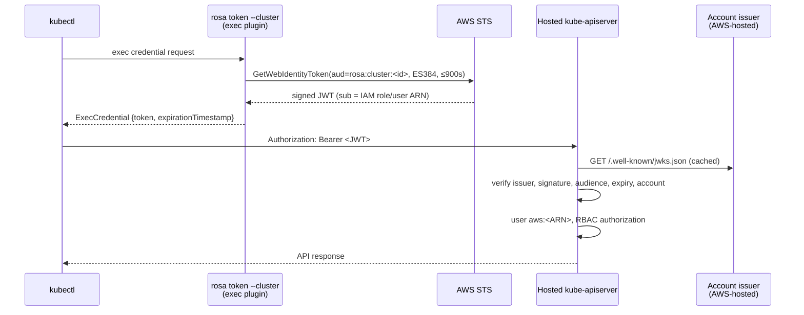
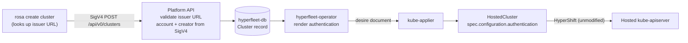

# AWS IAM Authentication for Hosted Clusters

**Last Updated Date**: 2026-10-05

## Summary

Customers need to log in to their hosted cluster's API server with the AWS IAM identities they already use for the Platform API, and the cluster creator needs admin access on day 1. This document describes two options. **No option has been chosen yet.**

- [Option A: AWS STS outbound identity federation](#option-a-aws-sts-outbound-identity-federation): the cluster trusts tokens that AWS signs for the customer's account. Implemented as a working POC.
- [Option B: HyperFleet-hosted OIDC issuer gated by Cedar](#option-b-hyperfleet-hosted-oidc-issuer-gated-by-cedar): HyperFleet checks Cedar policies and issues the tokens itself. Not yet designed in detail.

Both use the HostedCluster's existing external OIDC support (`spec.configuration.authentication.type: OIDC`) and need no HyperShift changes.

## Context

Hosted clusters have no user-facing authentication today. The only access is the `system:admin` client certificate kubeconfig extracted from the management cluster.

Constraints for any option:

- AWS IAM is the identity source.
- The cluster creator is admin on day 1 and grants everyone else access.
- CLI access works through a standard `kubectl` exec credential plugin with short-lived credentials.
- The kube-apiserver token webhook (`--authentication-token-webhook-config-file`) is a single slot that OpenShift owns. We must not take it.

### Requirement: Multiple Identity Providers (OCPSTRAT-1275)

Regardless of the option chosen, OCPSTRAT-1275 is a requirement. A HostedCluster accepts only one external OIDC provider today (`oidcProviders` has `MaxItems=1`), and AWS IAM login occupies it. OCPSTRAT-1275 is needed for multi-IdP console support:

- The first phase does not build a web console login path for AWS IAM login.
- Until then, customers need to add their own identity providers (for example Entra ID or Okta) alongside AWS IAM login, both for CLI access and for console login.

## Option A: AWS STS Outbound Identity Federation

AWS STS issues short-lived JWTs for IAM principals (`sts:GetWebIdentityToken`), signed with keys that AWS publishes at a per-account issuer URL. Each hosted cluster trusts its owner account's issuer. HyperFleet holds no keys and is not in the login path.

### Login



The ROSA CLI provides the exec plugin, `rosa token --cluster <id>`, and writes kubeconfigs that use it with `rosa create kubeconfig --cluster <id>`. Both are proposed additions; `rosa token` exists today and prints an OCM token. The token is valid for at most 15 minutes and never beyond the caller's AWS session. `kubectl` reuses it until shortly before it expires.

### Cluster Creation



1. **`rosa create cluster`** looks up the account's issuer URL (`iam:GetOutboundWebIdentityFederationInfo`) and sends it as `spec.awsIAMLoginIssuerURL`, the only new API field.
2. **Platform API** accepts only AWS STS issuer URLs and creators that are IAM roles or IAM users. The account ID and creator ARN are the existing service-set fields taken from the SigV4 caller.
3. **hyperfleet-operator** renders the HostedCluster's authentication configuration.
4. **HyperShift** turns it into the kube-apiserver's authentication configuration.

Example for cluster `3f6c2d1e-…` in account `111122223333`, created by a session of role `PlatformAdmins`:

```yaml
spec:
  configuration:
    authentication:
      type: OIDC
      oidcProviders:
        - name: aws-iam
          issuer:
            issuerURL: https://a1b2c3d4-….tokens.sts.global.api.aws
            audiences: ["rosa:cluster:3f6c2d1e-…"]
          oidcClients: []
          claimMappings:
            username:
              claim: sub
              prefixPolicy: Prefix
              prefix:
                prefixString: "aws:"
            groups:
              # The cluster creator is cluster-admin.
              expression: "claims.sub.startsWith('arn:aws:iam::111122223333:role/') && claims.sub.endsWith('/PlatformAdmins') ? ['system:cluster-admins'] : []"
          claimValidationRules:
            - type: CEL
              cel:
                expression: "claims['https://sts.amazonaws.com/'].aws_account == '111122223333'"
                message: token is from a different AWS account
```

API Gateway reports role sessions as `arn:aws:sts::<acct>:assumed-role/<Name>/<session>`, while tokens carry `sub = arn:aws:iam::<acct>:role/[<path>/]<Name>`. Role names are unique within an account regardless of path, so the creator rule matches the account and role name with any path. IAM users are matched exactly. The shared `api/iamauth` package holds these rules for both the Platform API and the operator.

### Access

- The creator is mapped to `system:cluster-admins`, which OpenShift binds to `cluster-admin`.
- Everyone else needs in-cluster RBAC on the username `aws:<ARN>`. The authentication configuration never changes after creation.

```sh
oc create clusterrolebinding developers-view --clusterrole=view \
  --user='aws:arn:aws:iam::111122223333:role/Developers'
```

`sub` is the IAM role ARN, not the session, so everyone who assumes a role shares one Kubernetes identity.

### Customer Setup

1. Enable outbound identity federation once per AWS account: `aws iam enable-outbound-web-identity-federation`. This creates the account's issuer, `https://<id>.tokens.sts.global.api.aws`. AWS offers it at no additional cost in commercial, GovCloud (US) and China regions.
2. Grant `sts:GetWebIdentityToken` to principals that log in. Customers can limit which clusters each principal may get tokens for, and for how long:

```json
{
  "Effect": "Allow",
  "Action": "sts:GetWebIdentityToken",
  "Resource": "*",
  "Condition": {
    "ForAllValues:StringEquals": {
      "sts:IdentityTokenAudience": ["rosa:cluster:<cluster-id>"]
    },
    "NumericLessThanEquals": { "sts:DurationSeconds": 900 }
  }
}
```

### Security

- **Tenant isolation**: each AWS account has its own issuer and signing keys. Because HyperFleet does not prove that the issuer URL belongs to the account, the `aws_account` rule is what keeps other accounts out; it must never be removed.
- **One cluster per token**: the audience `rosa:cluster:<id>` makes a token valid for one cluster only.
- **No network reach for tenants**: the kube-apiserver fetches keys from the issuer URL inside the management cluster network, so only `https://<id>.tokens.sts.global.api.aws` is accepted (Platform API, operator and CRD validation).
- **Privilege**: the only group ever issued is `system:cluster-admins`, and only for the creator. Groups are never taken from caller-controlled claims such as request or session tags.

### Platform Requirements

- The hosted cluster's release must be newer than OCP `5.0.0-ec.6`.
- The management cluster's HyperShift operator must be built from HyperShift `main` of 2026-07-07 or later, so its HostedCluster CRD accepts CEL claim mappings.
- Management clusters need HTTPS egress to `*.tokens.sts.global.api.aws`.

### Pros

- No signing keys and no new infrastructure on our side; AWS signs and hosts the keys.
- No HyperFleet service in the login path: logins keep working during Platform API or regional outages.
- One new API field; access changes are standard RBAC.
- Implemented and working end to end.

### Cons

- **Customers must enable outbound identity federation** in their AWS account and grant `sts:GetWebIdentityToken`.
- **Anyone in the account can authenticate**: any principal allowed to get a token for the cluster logs in as `system:authenticated`, without permissions until RBAC grants them. Restricting who can authenticate is left to the customer's IAM, which may not satisfy FedRAMP assessors.
- **No path to web console login**: the console needs an issuer with browser login endpoints, and AWS's issuer has none. Customers would log in to the console through their own identity provider once OCPSTRAT-1275 allows adding it.
- Depends on recent release payloads and HyperShift versions (see Platform Requirements).
- AWS IAM occupies the HostedCluster's only OIDC provider slot, so customers cannot add their own identity provider alongside it until OCPSTRAT-1275 is delivered (see [Requirement: Multiple Identity Providers](#requirement-multiple-identity-providers-ocpstrat-1275)).

### Implementation

POC pull requests (draft):

| Pull request                                                                                                 | Change                                                                                                                                                                   |
| ------------------------------------------------------------------------------------------------------------ | ------------------------------------------------------------------------------------------------------------------------------------------------------------------------ |
| [openshift-online/rosa-hyperfleet-api#534](https://github.com/openshift-online/rosa-hyperfleet-api/pull/534) | `awsIAMLoginIssuerURL` field, shared `api/iamauth` rules, Platform API validation, operator rendering, release `5.0.0-rc.5`                                              |
| [openshift-online/rosa-hyperfleet-cli#147](https://github.com/openshift-online/rosa-hyperfleet-cli/pull/147) | POC in `rosactl`, to be implemented in the ROSA CLI: exec-plugin token via `GetWebIdentityToken` (capped at the AWS session lifetime), issuer lookup at cluster creation |
| [openshift-online/rosa-hyperfleet#833](https://github.com/openshift-online/rosa-hyperfleet/pull/833)         | This document; upstream HyperShift operator image on management clusters                                                                                                 |

## Option B: HyperFleet-Hosted OIDC Issuer Gated by Cedar

> ⚠️ **Not yet designed.** This option is an early direction and needs to be fleshed out (architecture, key management, availability, security review and effort) before it can be compared with Option A.

Each hosted cluster trusts an OIDC issuer that HyperFleet hosts instead of AWS's issuer:

1. `rosa token --cluster <id>` proves the caller's AWS identity to HyperFleet, with SigV4 or a presigned `sts:GetCallerIdentity`.
2. HyperFleet evaluates Cedar policies: may this principal access the cluster, and with which groups?
3. If allowed, HyperFleet returns a short-lived JWT (`sub` = caller ARN, `aud` = cluster, `groups` from the Cedar decision) signed with a key HyperFleet holds.

What it would offer:

- **Deny by default, enforced by HyperFleet**: principals without access get no token (401), similar to EKS access entries.
- **No customer AWS setup**, and principals from other accounts can be granted access directly.
- **Access managed in Cedar**, the same model as the rest of the Platform API, without touching the cluster's configuration.
- **Web console login**: the issuer can also serve browser login endpoints. A CLI-assisted flow fits: a `rosa` command gets a single-use ticket with SigV4, opens the console, and the issuer approves the console's login request without a login page.
- **No CEL in the cluster configuration**, so no dependency on recent release payloads.

What it would cost:

- HyperFleet becomes an identity provider holding signing keys that can grant cluster access, which brings key management, rotation and related FedRAMP controls into our scope.
- A HyperFleet service enters the login path.

To explore, mainly where the issuer runs:

- **Regional, in the Platform API**: signing with an AWS KMS key, discovery documents published through the existing regional OIDC S3/CloudFront setup. Closest to the existing Cedar evaluation, but logins to every cluster in the region would depend on the regional Platform API, and one service could sign for every tenant in the region.
- **Per cluster, next to the hosted control plane**: a small token/OIDC service with a per-cluster key and an access list synced from the Platform API. Logins share the kube-apiserver's failure domain and a compromise is limited to one cluster, at the cost of an extra pod and public endpoint per cluster and per-cluster key rotation.

## Rejected Alternatives

- **`aws-iam-authenticator` sidecar** (previous experimental design): a sidecar validated presigned `sts:GetCallerIdentity` tokens through the kube-apiserver's token webhook. Rejected because that webhook is a single slot that OpenShift uses for its integrated OAuth server and that future OCP authentication plans depend on. It also required a forked HyperShift build and mapped the creator to `system:masters`, which bypasses authorization.
- **OpenShift integrated OAuth server with an OpenID identity provider**: rejected because users get opaque, long-lived (24 hours by default) OAuth tokens validated through OpenShift's token webhook instead of JWTs, there is no exec-plugin path (CLI tokens come from a browser login), and it is not OpenShift's strategic direction. It also needs an upstream identity provider with interactive login, which AWS STS does not offer, so HyperFleet would still have to host one (Option B).

## Related Documentation

- [IAM outbound identity federation](https://docs.aws.amazon.com/IAM/latest/UserGuide/id_roles_providers_outbound.html)
- [Kubernetes structured authentication configuration](https://kubernetes.io/docs/reference/access-authn-authz/authentication/#using-authentication-configuration)
- [kube-applier Resource Distribution](kube-applier-architecture.md)
- [Regional OIDC Ownership](regional-oidc-ownership.md) (service-account issuer; unrelated to user login)
