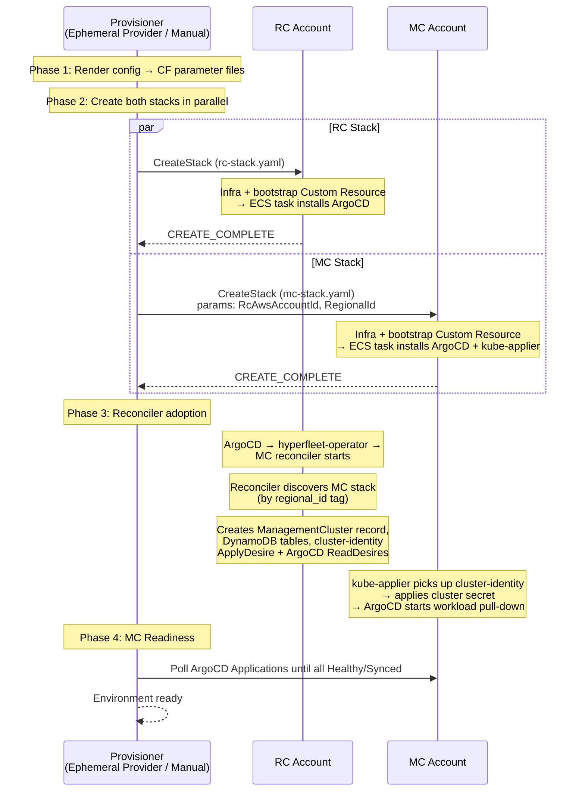
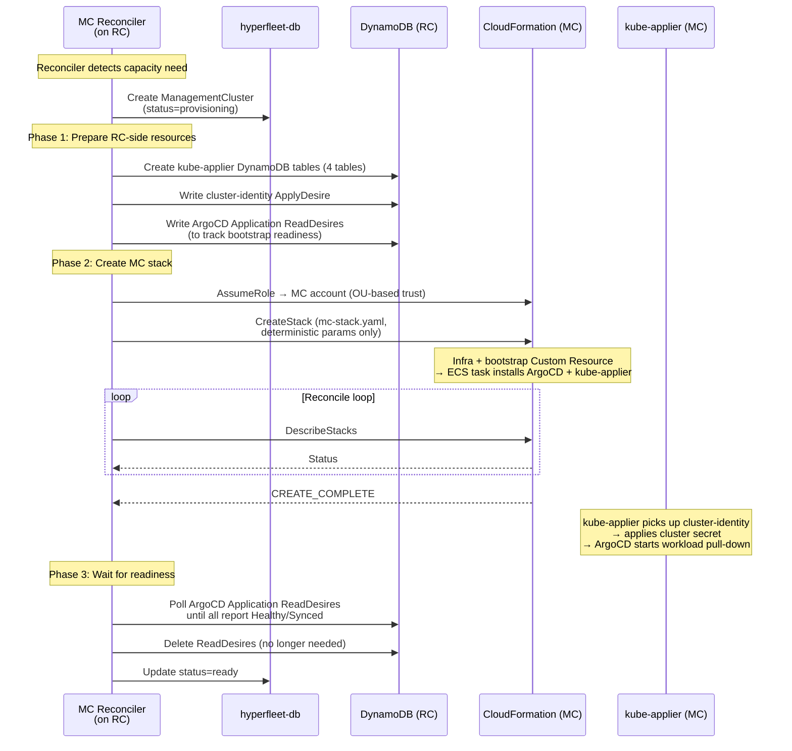
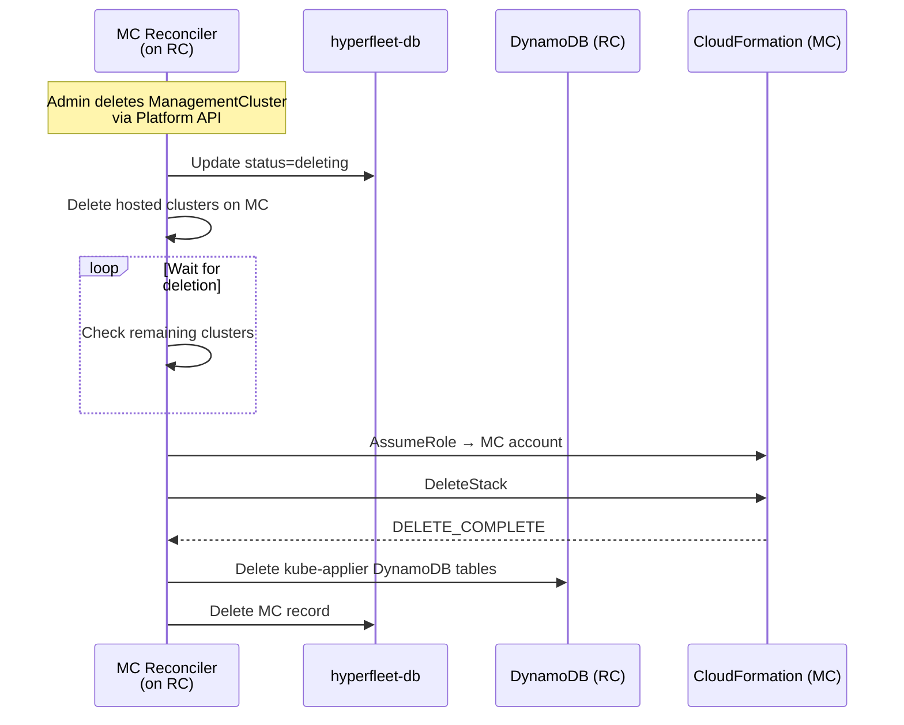

# CloudFormation Stack-Based Provisioning

**Status:** Draft — for team discussion
**Date:** 2026-08-12

## Motivation

1. **Complexity cliff.** Provisioning spans 7 Terraform configs, 6+ bash scripts, 3 CodePipelines, an ECS Fargate bootstrap, and a Python orchestrator — ~15 files across 4 languages.
2. **Pipeline-based MC provisioning is a dead end.** The MC reconciler will dynamically create MCs without git commits. Pipeline-triggered provisioning doesn't support this.
3. **Developer experience.** Ephemeral provisioning requires creating a git branch, bootstrapping a central account pipeline, and waiting for 3 chained CodePipelines. A direct `CreateStack` call is faster and more debuggable.

## Requirements

- AWS-native provisioning that simplifies the current Terraform + CodePipeline approach
- MC reconciler can provision MCs directly without pipeline orchestration
- GitOps for updating existing infrastructure and workloads (git push → infra + workload update)
- Shared AWS accounts: dev/CI environments share AWS accounts, so multiple stacks must coexist in the same account+region without resource collisions
- Cross-account data path: RC values and secrets must be shareable with MC accounts
- Dev/CI parity: provision full, customizable, fully isolated environments in ~30 minutes
- FedRAMP compliant: all infrastructure must meet FedRAMP Moderate requirements (encryption at rest, FIPS endpoints, audit logging, etc.)
- _(Optional)_ Support provisioning RC-only or MC-only stacks for development

## Alternatives Considered

| Alternative                 | Why not                                                                                                   |
| --------------------------- | --------------------------------------------------------------------------------------------------------- |
| Terraform without pipelines | Still requires state management (S3 backend, locking). Reconciler would need to shell out to `terraform`. |
| CDK                         | Adds a transpilation layer and Node.js dependency. Fallback option if raw YAML becomes unwieldy.          |
| Pulumi                      | Not AWS-native. Adds a third-party dependency and state service.                                          |
| Raw SDK calls (no IaC)      | No drift detection, no declarative state, no rollback. Operational burden too high.                       |

CloudFormation is AWS-native (no state backend, IAM-integrated, change sets for dry-run), and the reconciler can call `CreateStack`/`UpdateStack`/`DeleteStack` directly via the AWS SDK.

---

## Current Architecture Findings

### RC ↔ MC Dependencies

The MC _infrastructure_ (VPC, EKS, IAM roles) does **not** need the RC to exist. All MC dependencies at stack creation time are deterministic — constructed from config values (`RcAwsAccountId`, `RegionalId`) and naming conventions.

Only two dependencies are non-deterministic: **RHOBS API URL** and **OIDC CloudFront domain** (generated by AWS). These are only needed at workload time (via the cluster secret), not at stack creation. This enables parallel RC + MC stack creation.

| Non-deterministic dependency | Needed at           | Delivery mechanism            |
| ---------------------------- | ------------------- | ----------------------------- |
| RHOBS API Gateway URL        | MC workload startup | Cluster-identity via DynamoDB |
| OIDC CloudFront domain       | MC workload startup | Cluster-identity via DynamoDB |

### Cross-Account Access Patterns

All runtime cross-account access uses OU-based IAM trust (`aws:PrincipalOrgPaths`). Adding a new MC to the correct OU automatically grants access — no cross-stack wiring needed.

| Pattern                    | Used By                                       |
| -------------------------- | --------------------------------------------- |
| OU-based role trust        | OIDC writer, DNS zone operator, ZOA S3/KMS    |
| Org-scoped resource policy | RHOBS API Gateway, DynamoDB resource policies |
| SigV4 API GW invocation    | Prometheus remote_write, Loki log forwarding  |
| Explicit account trust     | Grafana CloudWatch Logs reader                |

### Resource Naming

All resources are scoped by `{regional_id}`, preventing collisions in shared accounts. One exception: the API Gateway CloudWatch logging role (`aws_api_gateway_account`) is an AWS-enforced per-account singleton — created once as a shared prerequisite.

### Terraform → CloudFormation Compatibility

All 32 Terraform modules use AWS resource types with CF equivalents. Notable workarounds:

- **`for_each`/`count`** → `Fn::ForEach` (LanguageExtensions transform — string-list only, no filtering/nesting)
- **PagerDuty provider** → manage separately (no CF equivalent)
- **FedRAMP**: all CF API calls must use the FIPS endpoint (`cloudformation-fips.{region}.amazonaws.com`)

---

## Proposed Design

### Terminology

- **ECS bootstrap task**: Fargate task that installs ArgoCD + kube-applier on a cluster. Triggered by the bootstrap Custom Resource.
- **Bootstrap Custom Resource**: CF resource (backed by a Lambda) that starts the ECS bootstrap task and passes the CF `ResponseURL`. The ECS task sends `cfn-response` on completion. If the task crashes without responding, CF waits 1 hour then rolls back.
- **ApplyDesire / ReadDesire**: kube-applier's DynamoDB-based primitives. An ApplyDesire tells kube-applier to apply a K8s resource on the MC. A ReadDesire tells it to watch a K8s resource and mirror its state back to DynamoDB. The reconciler writes desires; kube-applier on the MC consumes them via DynamoDB Streams.

### Stack Architecture

Two CF stack templates replace 7 Terraform configs and 3 CodePipelines. The resource list reflects the current state and will evolve:

| Stack        | Account    | Nested stacks                                                            | Creates (summary)                                                                    |
| ------------ | ---------- | ------------------------------------------------------------------------ | ------------------------------------------------------------------------------------ |
| **RC Stack** | RC account | `networking`, `eks`, `databases`, `api-gateways`, `observability`, `iam` | VPC, EKS, Aurora PostgreSQL, API GWs, ElastiCache Valkey, OIDC, DNS, ZOA, CloudTrail |
| **MC Stack** | MC account | `networking`, `eks`, `iam`                                               | VPC, EKS, Pod Identity roles, HyperShift OIDC                                        |

Both stacks include a bootstrap Custom Resource that triggers the ECS bootstrap task on creation.

### Initial Provisioning (Parallel RC + MC)

The MC infra creates in parallel with the RC, but the MC isn't _functional_ until the reconciler catches up (creates DynamoDB tables + writes cluster-identity). Between MC bootstrap and reconciler adoption, kube-applier retries until tables exist — the MC is idle, not broken.

This is the same flow for all MCs. Whether the MC stack was created by the provisioner (initial) or by the reconciler (scale-up), the reconciler always creates DynamoDB tables, writes cluster-identity, and manages the MC from that point on.

### Current vs Proposed

| Dimension       | Current (Pipelines)                                            | Proposed (CF Stacks)                                       |
| --------------- | -------------------------------------------------------------- | ---------------------------------------------------------- |
| Provision       | 6 steps (branch, render, push, bootstrap central, 3x pipeline) | 2 steps (render, create both stacks)                       |
| Central account | Required                                                       | Not needed                                                 |
| Git branch      | Required (triggers pipeline creation)                          | Not needed                                                 |
| Time            | ~30-45 min (sequential pipelines)                              | ~15-20 min (parallel stacks, EKS is the bottleneck)        |
| Teardown        | 3-phase git-push-driven destroy                                | Workload teardown + `DeleteStack` per stack                |
| Dry-run         | `terraform plan`                                               | `create-change-set` (shows adds/modifies/removes/replaces) |

---

## MC Lifecycle (Reconciler)

The MC reconciler (part of hyperfleet-operator on RC) manages the **full lifecycle of all MCs** — including the initial MC created during provisioning. It uses Pod Identity with OU-based trust to assume into MC accounts.

The reconciler autonomously scales MCs based on capacity needs. Admin overrides are possible via Platform API → ManagementCluster object.

### Create

Triggered by: reconciler detects capacity need (or admin creates ManagementCluster via Platform API). Same flow for adoption of the initial MC.

### Update (Progressive Rollout)

Each ManagementCluster record has a `desiredRevision` field. The environment-level `git.revision` config sets the **target** revision, stored in a ConfigMap on the RC (rendered by `render.py`, synced by ArgoCD). The reconciler watches this ConfigMap and progressively moves MCs toward the target:

1. Update MC-1's `desiredRevision` → `UpdateStack` with template at that revision + update cluster secret `git_revision` annotation
2. Health gate: wait for CF stack stable + ArgoCD applications all Healthy/Synced
3. Update MC-2's `desiredRevision` → repeat

Both infra (CF template) and workloads (ArgoCD charts) move together per MC, controlled by a single revision. On failure, the reconciler halts the rollout — manual intervention to proceed or rollback.

Templates are synced from git to S3 on merge (keyed by commit hash). The reconciler reads the template at the MC's `desiredRevision` from S3.

### Delete

Triggered by: admin deletes ManagementCluster via Platform API.

---

## GitOps Sync

**Persistent environments (int/stage/prod):** A CodeBuild webhook on `main` triggers on push. The buildspec checks which directories changed: RC template dir → `create-change-set` + `execute-change-set`, MC template dir → sync to S3 (reconciler handles rolling `UpdateStack`), ArgoCD-only changes → no-op (ArgoCD auto-syncs).

**Ephemeral environments:** **Open question** — how ephemeral environments receive git-push updates. The challenge: developers often work from personal forks, and CodeStar Connections are scoped to a single GitHub App installation (one per GitHub org/user). Options under consideration:

1. **Mirror-based (current model):** Ephemeral provider maintains a mirror of the developer's fork in a location accessible to a shared CodeStar Connection. Developer resyncs to push changes. Same CodeBuild path as prod, but requires explicit resync steps.
2. **Manual update:** Developer runs a CLI command (e.g., `make ephemeral-update`) to push CF changes directly. ArgoCD still auto-syncs workload changes from the fork. Simpler, but infra updates don't flow through the same GitOps path as prod.

The trade-off is GitOps parity (ephemeral uses the same update path as prod) vs. simplicity (no resync, no extra infrastructure). This needs team input.

### Ephemeral Developer Flow

**Current:** Create branch → render → push → bootstrap central account → wait for 3 chained pipelines → resync on changes → 3-phase teardown.

**New (provisioning + teardown):** `render.py` → `CreateStack` RC + MC (parallel) → wait for readiness. Teardown: `DeleteStack` both stacks. No central account.

**New (ongoing changes):** Depends on open question above. ArgoCD auto-syncs workload/chart changes regardless. Infra (CF template) updates need a trigger mechanism — see options above.

### Rollback and Drift

- **Dry-run:** `create-change-set` before applying updates (equivalent to `terraform plan`). Use for integration environment updates at minimum.
- **Rollback:** CF automatically rolls back on failure. Protect critical resources (EKS, RDS, KMS) with `DeletionPolicy: Retain` and stack policies.
- **Drift:** On-demand via `DetectStackDrift`. Does not cover Custom Resources or all resource properties.

---

## Required Changes

### New (to build)

| Component                       | Description                                                                                                           |
| ------------------------------- | --------------------------------------------------------------------------------------------------------------------- |
| `rc-stack.yaml` + nested stacks | RC CF template: `networking`, `eks`, `databases`, `api-gateways`, `observability`, `iam`                              |
| `mc-stack.yaml` + nested stacks | MC CF template: `networking`, `eks`, `iam` + bootstrap Custom Resource                                                |
| Bootstrap Lambda                | CF Custom Resource — starts ECS bootstrap task, passes CF `ResponseURL`. ECS task sends `cfn-response` on completion. |
| Template S3 bucket              | Versioned MC + nested stack templates. OU-based bucket policy for cross-account CF access from MC accounts.           |
| CodeBuild project (GitOps sync) | Webhook on `main` — change sets for RC, S3 sync for MC templates                                                      |
| Ephemeral provider updates      | Replace pipeline creation with `CreateStack` calls                                                                    |

### Modified (in hyperfleet-operator)

| Component              | Change                                                                                        |
| ---------------------- | --------------------------------------------------------------------------------------------- |
| MC reconciler — create | Create DynamoDB tables → write desires → `CreateStack` (deterministic params only)            |
| MC reconciler — update | Compare stack template version against S3, `UpdateStack` on drift (rolling, one MC at a time) |
| MC reconciler — delete | Delete hosted clusters → `DeleteStack` → delete DynamoDB tables                               |
| MC reconciler — adopt  | Discover existing MC stack by `regional_id` tag → same flow as create                         |

### Removed

| Component                                     | Current location                                                              |
| --------------------------------------------- | ----------------------------------------------------------------------------- |
| Central account bootstrap                     | `terraform/config/central-account-bootstrap/`                                 |
| Pipeline provisioner (CodePipeline+CodeBuild) | `terraform/modules/pipeline-provisioner/`                                     |
| Pipeline RC / Pipeline MC                     | `terraform/config/pipeline-regional-cluster/`, `pipeline-management-cluster/` |
| Buildspec scripts                             | `scripts/buildspec/`                                                          |
| Pipeline notifications                        | `terraform/modules/pipeline-notifications/`                                   |
| Ephemeral branch creation for provisioning    | `ci/ephemeral-provider/`                                                      |

---

## Migration Strategy

1. **Phase 1 (1-2 sprints):** MC stack first (simpler, ~80 resources). Test alongside existing TF-managed RC.
2. **Phase 2 (2-3 sprints):** RC stack. CodeBuild webhook for GitOps. Update ephemeral provider.
3. **Phase 3 (1-2 sprints):** MC reconciler integration.
4. **Phase 4 (1 sprint):** Remove old pipeline infrastructure.

No state migration — new environments are provisioned fresh. Existing int/stage/prod environments are not migrated. DNS environment zone is a manual one-time setup.

---

## Testing

### CI (pre-merge)

- **CF linting:** `cfn-lint` on all templates (RC + MC + nested stacks)
- **CF validation:** `aws cloudformation validate-template` dry run
- **Render check:** `render.py` produces valid CF parameter files for all environments

### E2E (rosa-hyperfleet-api, run against ephemeral environment)

Existing E2E suites (`e2e-api`, `e2e-cli`, `e2e-sdk`, `e2e-zoa`, `e2e-platform-monitoring`) continue as-is. New tests for reconciler lifecycle:

| Test                            | Validates                                                                |
| ------------------------------- | ------------------------------------------------------------------------ |
| Reconciler adopted initial MC   | ManagementCluster record exists, desires owned by reconciler, MC healthy |
| Reconciler creates new MC       | Stack created, bootstrap completes, ArgoCD apps healthy via ReadDesire   |
| Reconciler deletes MC           | Hosted clusters deleted, stack deleted, DynamoDB tables cleaned up       |
| Progressive rollout             | ConfigMap update → reconciler rolls MCs with health gates                |
| Ephemeral teardown (no orphans) | Both stacks deleted cleanly, no orphaned resources in shared account     |

### Manual validation (one-time per migration phase)

| Test                                | Validates                                         |
| ----------------------------------- | ------------------------------------------------- |
| Parallel RC + MC from scratch       | Full provisioning, cluster-identity via DynamoDB  |
| Multiple ephemerals in same account | No resource collisions (`regional_id` scoping)    |
| GitOps sync (RC + MC changes)       | CodeBuild triggers change set / S3 sync correctly |

---

## Risks

| Risk                                                           | Severity | Mitigation                                                                               |
| -------------------------------------------------------------- | -------- | ---------------------------------------------------------------------------------------- |
| Loss of `terraform plan` visibility                            | High     | Use `create-change-set` for dry-run; enforce for integration at minimum                  |
| CF template verbosity vs TF modules                            | Medium   | Nested stacks + `Fn::ForEach`; evaluate CDK if YAML becomes unwieldy                     |
| `Fn::ForEach` limitations (string-list only, no nesting)       | Medium   | Some TF patterns will need restructuring; evaluate at implementation time                |
| `UPDATE_ROLLBACK_FAILED`                                       | Medium   | `DeletionPolicy: Retain` + stack policies on critical resources (EKS, RDS, KMS)          |
| Custom Resource crash → 1-hour stack hang                      | Medium   | ECS task timeout + dead-letter alerting; test failure paths in ephemeral environments    |
| CF 500 resources per stack limit                               | Medium   | Mitigated by nested stacks (500 per nested stack); monitor resource counts               |
| Reconciler blast radius (can create resources in any MC in OU) | Medium   | SCP scoping to limit which actions the reconciler role can perform in MC accounts        |
| FIPS endpoint enforcement                                      | Medium   | Configure FIPS endpoints in SDK/CLI config for all CF, Lambda, and CodeBuild API calls   |
| Team CF learning curve                                         | Medium   | Start with MC stack (simpler); pair programming during Phase 1                           |
| Silent drift accumulation                                      | Low      | CF drift detection is partial (no Custom Resources). Periodic manual audits for FedRAMP. |
