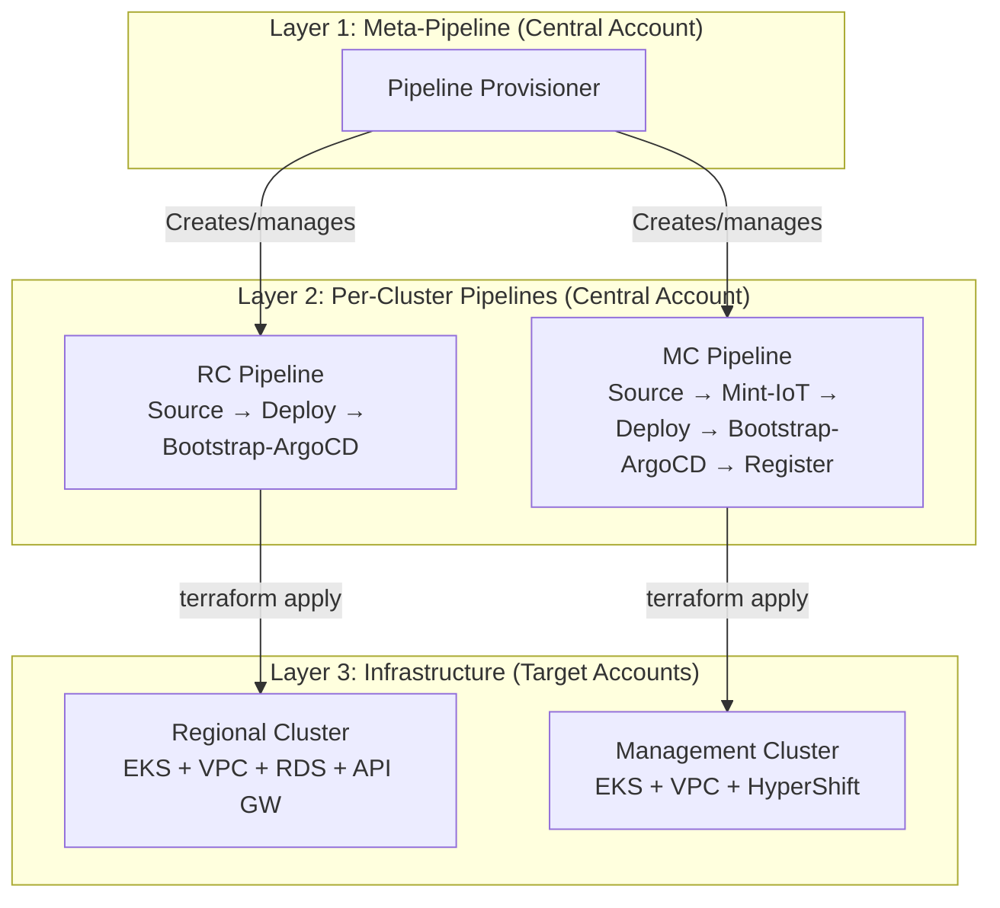
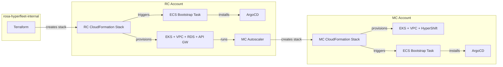
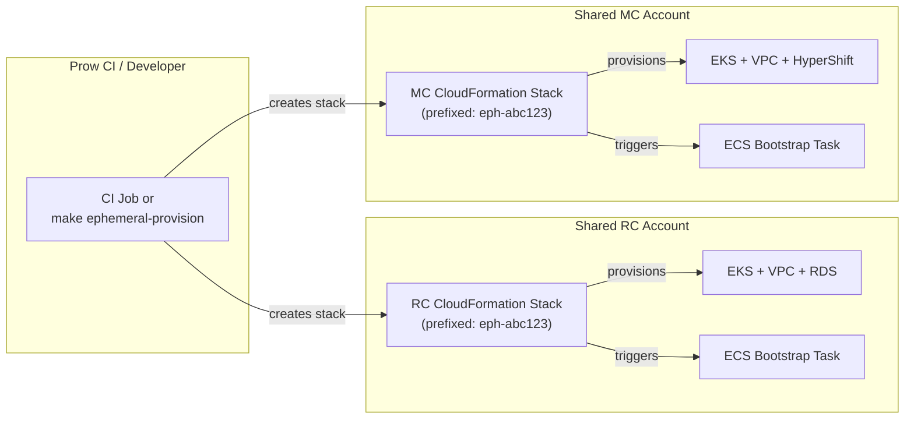
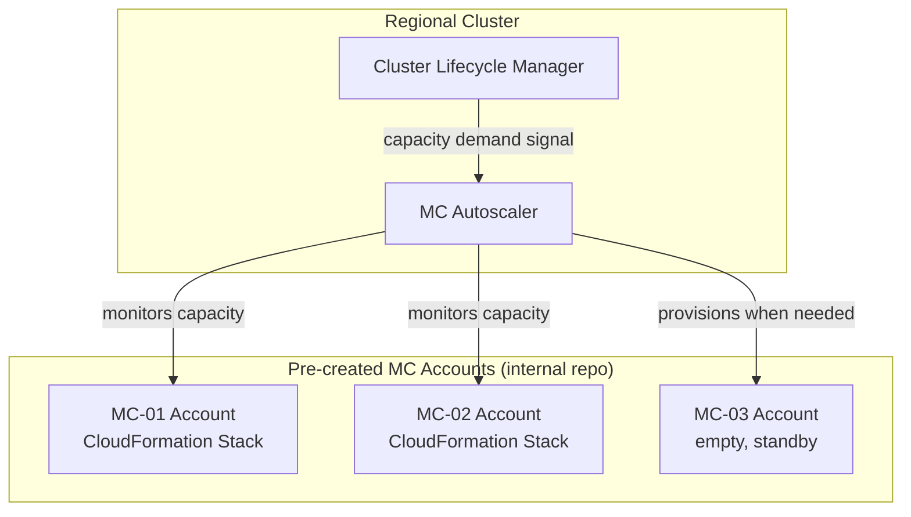

# Removal of AWS CodePipeline: CloudFormation-Based Provisioning

**Last Updated Date**: 2026-07-17

**Status**: DRAFT / PROPOSAL

## Summary

Replace the current three-tier AWS CodePipeline architecture with a simpler model:
Terraform in the internal repo provisions all AWS accounts and IAM across all environments,
and CloudFormation stacks handle RC/MC cluster lifecycle. Stable environments (int, stage, prod)
get their RCs provisioned by Terraform and their MCs scaled by a new autoscaler component running
on the RC. Ephemeral and dev environments get both RCs and MCs provisioned on-the-fly by Prow CI
via CloudFormation stacks.

## Context

### Problem Statement

The current CodePipeline architecture works but introduces complexity that is becoming a burden:

- **Three-tier indirection**: A meta-pipeline creates per-cluster pipelines, which then provision
  infrastructure. Debugging failures requires navigating CodePipeline console, CodeBuild logs,
  Terraform state, and cross-account IAM in sequence.
- **Central account coupling**: All pipelines run from a central account that must have
  broad cross-account IAM permissions, creating a blast radius concern.
- **Slow feedback loops**: CodePipeline cold-starts, artifact transfers, and sequential
  stage execution add latency to every provisioning operation.
- **CodeStar/GitHub coupling**: The CodeStar connection requires manual console authorization
  and introduces a dependency on AWS's GitHub integration.
- **Maestro removal**: The planned removal of Maestro (MQTT-based RC-to-MC configuration
  distribution) eliminates several pipeline stages (IoT certificate minting, MC registration)
  and changes the fundamental MC provisioning flow.

### What CodePipeline Does Today



Key stages that would be affected:

| Pipeline Stage | What It Does | Post-Maestro Status |
| --- | --- | --- |
| RC Deploy | Terraform apply for EKS, VPC, RDS, API GW, IoT Core | IoT Core no longer needed |
| RC Bootstrap-ArgoCD | ECS task installs ArgoCD, syncs platform apps | Still needed |
| MC Mint-IoT | Create X.509 certs in RC account for Maestro | **Removed** (no Maestro) |
| MC Deploy | Terraform apply for EKS, VPC | Still needed |
| MC Bootstrap-ArgoCD | ECS task installs ArgoCD, syncs HyperShift + Maestro Agent | Maestro Agent removed |
| MC Register | Call RC Platform API to register MC as consumer | **Changed** (see below) |

### Assumptions

- Maestro (MQTT-based configuration distribution) is being removed. The replacement
  mechanism is being designed separately and is out of scope for this proposal.
- The internal repo (`rosa-hyperfleet-internal`) is the right home for account-level Terraform
  because it already manages account minting and IAM.
- Nothing is in production today, so we can rebuild all environments from scratch rather than
  migrating state.

## Proposed Architecture

### Pillar 1: Internal Repo Owns All Account Infrastructure

The `rosa-hyperfleet-internal` repo's Terraform expands from its current scope (account minting,
control-account IAM, CI user) to own **all** account-level infrastructure across all environments:

```
rosa-hyperfleet-internal/infra/
├── account-bootstrap/        # existing: initial admin roles
├── account-minter/           # existing: AWS Organizations account creation
├── control-account/          # existing: IAM roles, DNS, CI resources
├── regional-account/         # NEW: per-RC-account IAM, networking foundations
└── management-account/       # NEW: per-MC-account IAM, networking foundations
```

**Scope of "all accounts":**

| Environment | Regions | RC Accounts | MC Accounts | Provisioning Cadence |
| --- | --- | --- | --- | --- |
| ephemeral | 1 per run | 1 (shared) | 1 (shared) | On-demand (Prow CI) |
| dev | 1-2 | 1-2 | 2-4 | On-demand (developer) |
| ci | 1 | 1 | 2 | Stable |
| int | 1-2 | 1-2 | 2-4 | Stable |
| stage | 2-3 | 2-3 | 4-6 | Stable |
| prod | many | many | many | Stable |

**What moves to the internal repo:**

- Cross-account IAM roles currently created by CodeBuild (the `OrganizationAccountAccessRole`
  trust relationships)
- State bucket creation (currently done by `scripts/bootstrap-state.sh` during pipeline bootstrap)
- DNS zone delegation (currently in `control-account/dns.tf`, expanding to per-region zones)
- MC account pre-creation for the autoscaler pool (accounts are pre-declared in config and
  pre-provisioned; the autoscaler only provisions infrastructure within existing accounts)

### Pillar 2: CloudFormation Stacks for RC and MC Provisioning

Replace the per-cluster CodePipelines with CloudFormation stacks that provision EKS clusters
and their supporting infrastructure.

#### Stable Environments (int, stage, prod)



- **RC provisioning**: Terraform in the internal repo creates a CloudFormation stack in the
  RC account. The stack provisions EKS, VPC, RDS, API Gateway, and the ECS bootstrap
  infrastructure. A CloudFormation custom resource triggers the ECS bootstrap task to
  install ArgoCD after EKS is ready.
- **MC provisioning**: The MC Autoscaler creates CloudFormation stacks in MC accounts.

#### Ephemeral and Dev Environments



- Accounts are shared across ephemeral environments (same as today). Isolation is achieved
  through unique resource name prefixes (`eph-{id}-*`).
- No locking needed: multiple environments coexist in the same accounts with different prefixes
  (same pattern as today).
- Teardown: delete the CloudFormation stacks. CloudFormation handles resource cleanup natively,
  which is simpler than today's two-phase pipeline deletion.
- Account cleanup: the existing `aws-nuke-cf` janitor continues to catch any leaked resources.

### Pillar 3: MC Autoscaler (Stable Environments Only)

A new controller running on the RC that manages MC lifecycle:



- **Account sourcing**: MC accounts are pre-created by the internal repo's account-minter and
  declared in configuration. The autoscaler picks from this pool; it does not create accounts.
- **Cross-account access**: The autoscaler assumes a dedicated IAM role in each MC account
  (created by the internal repo's Terraform) to create/delete CloudFormation stacks.
- **CloudFormation template source**: The MC template is stored in S3 (uploaded as part of
  the platform release process) so the autoscaler always uses a versioned, tested template.

**Open design questions for the MC Autoscaler:**

- **Capacity signal**: What metric drives scaling? Number of HostedClusters per MC?
  Node count? Resource pressure?
- **Scale-down**: Can the autoscaler decommission an MC? What happens to hosted clusters
  on that MC? (Migration? Drain? Block scale-down if non-empty?)
- **MC registration**: After creating an MC, the autoscaler needs to register it with the
  RC's Platform API. This replaces the old pipeline "Register" stage.

## CloudFormation vs. Terraform

### Why CloudFormation

Assuming the conversion work is done, CloudFormation has structural advantages for this
use case:

| Concern | CloudFormation | Terraform |
| --- | --- | --- |
| **State management** | AWS-managed, no S3 buckets to provision or protect | S3 state files + DynamoDB lock tables per account |
| **Rollback** | Automatic on failure, returns to last known-good state | Manual intervention required |
| **Drift detection** | Built-in, on-demand or scheduled | Requires running `terraform plan` |
| **Deletion** | Delete stack removes all resources in dependency order | `terraform destroy` requires state file access |
| **Programmatic creation** | `aws cloudformation create-stack` from any SDK | Requires Terraform CLI installed + state backend configured |
| **Autoscaler integration** | SDK call from a Go controller is trivial | Would need to shell out to `terraform` or use the Go Terraform SDK |
| **Audit** | CloudTrail records every stack operation natively | Requires custom logging around apply/destroy |
| **Permissions** | Stack creator needs CloudFormation + resource perms | Same resource perms + state bucket access |

The programmatic creation point is particularly important: the MC Autoscaler is a Go controller
running on the RC. Creating a CloudFormation stack is a single SDK call. Running Terraform
from a controller requires either shelling out to the CLI (brittle) or embedding the Terraform
Go SDK (heavy dependency).

### CloudFormation Cons

- **Slower iteration**: YAML/JSON templates are more verbose than HCL. No interpolation
  functions as powerful as Terraform's. Debugging template errors is harder.
- **Limited modularity**: Nested stacks exist but are less flexible than Terraform modules.
  Cross-stack references use exports/imports, which create tight coupling.
- **Custom resources for gaps**: Anything CloudFormation doesn't support natively requires
  a Lambda-backed custom resource. Terraform providers cover more services.
- **No plan equivalent**: CloudFormation change sets exist but are less informative than
  `terraform plan`. Harder to review infrastructure changes before applying.
- **Vendor lock-in**: CloudFormation is AWS-only. Terraform can target multiple providers.
  (Not a practical concern for us since this is all AWS.)
- **Community ecosystem**: Terraform has richer community modules (e.g., the EKS module).
  CloudFormation relies on AWS-maintained resource types.

### If We Keep Terraform: Execution Alternatives

If the team prefers to keep the existing Terraform modules and only replace the
CodePipeline orchestration layer, the options are:

| Option | How It Works | Pros | Cons |
| --- | --- | --- | --- |
| **Terraform Cloud** | Workspaces per cluster, VCS-triggered or API-driven runs | Managed state, plan/apply UI, team workflows, native GitHub integration | Cost per workspace, external dependency, network access to private resources |
| **Prow + Terraform** | Prow job runs `terraform apply` in a container with AWS credentials | Already using Prow, full control, no new services | Need container image with Terraform, state bucket management, no built-in rollback |
| **ECS Task + Terraform** | Replace CodeBuild with ECS Fargate tasks that run terraform | Same VPC access as today's bootstrap, can reach private EKS | Still need to manage state buckets, task definitions, IAM; reinventing CodeBuild |
| **Kubernetes Job** | Controller on RC creates Jobs that run `terraform apply` | Autoscaler can manage Jobs natively, in-cluster logging | Terraform CLI in container, state management, needs cross-account credentials |

**Terraform Cloud** is worth serious consideration. It eliminates state file management,
provides a review UI for plans, and supports API-driven runs (which the MC Autoscaler
could trigger). The main concern is whether Terraform Cloud agents can reach our private
EKS clusters and VPCs. Self-hosted agents running inside the VPC would solve this but
add operational overhead.

## ArgoCD Bootstrap

The existing ECS bootstrap mechanism is well-designed and should be retained regardless of
whether we use CloudFormation or Terraform for cluster provisioning. The ECS task:

1. Runs in the same VPC as the private EKS cluster (no public API exposure)
2. Gets cluster-admin access via EKS Access Entries (IAM-based, no kubeconfig secrets)
3. Installs ArgoCD via Helm, creates the root Application, and hands off to GitOps
4. Is fully idempotent (safe to re-run)

**With CloudFormation**: The ECS bootstrap task can be triggered as a CloudFormation custom
resource (Lambda that calls `ecs:RunTask` and waits for completion). This keeps the entire
provisioning flow as a single stack operation: EKS created, dependencies satisfied,
custom resource triggers bootstrap, stack reports complete only after ArgoCD is running.

**With Terraform**: A `null_resource` with a local-exec provisioner (or the `aws_ecs_task`
approach) runs the ECS task after `module.eks` completes. This is essentially what happens
today via buildspecs, just without the CodePipeline wrapper.

Either way, the ECS task definition and bootstrap script remain largely unchanged.

## Developer Flow

This is the most important section. The provisioning overhaul must preserve (and ideally
improve) the developer experience.

### Current Developer Flow (CodePipeline)

```
Developer                         System
─────────                         ──────
make ephemeral-provision
  ├─ pick repo + branch (fzf)
  ├─ generate unique ID
  ├─ resolve AWS creds (SAML)
  ├─ create ephemeral git branch
  │   in fork with config overlay
  ├─ push branch
  └─ bootstrap-central-account.sh ──→ Creates CodePipeline meta-pipeline
                                      │
                                      ├─→ Builds platform image (CodeBuild)
                                      ├─→ Creates RC pipeline (CodePipeline)
                                      │     ├─→ terraform apply (CodeBuild)
                                      │     └─→ ECS bootstrap ArgoCD
                                      └─→ Creates MC pipeline (CodePipeline)
                                            ├─→ Mint IoT certs (CodeBuild)
                                            ├─→ terraform apply (CodeBuild)
                                            ├─→ ECS bootstrap ArgoCD
                                            └─→ Register MC with RC

make ephemeral-resync ID=xxx
  └─ rebase eph branch, force-push ──→ CodePipeline triggers, re-applies

make ephemeral-teardown ID=xxx
  └─ set delete flags, push ─────────→ Phase 1: pipelines terraform destroy
                                       Phase 2: meta-pipeline destroys pipelines
```

**Pain points:**

- Provisioning takes 30-45 minutes (pipeline cold-starts, sequential stages)
- Debugging requires AWS Console access to CodePipeline + CodeBuild in the central account
- The ephemeral git branch dance (fork, push, CodeStar) adds fragile moving parts
- Resync re-triggers the entire pipeline even for application-only changes
- Teardown is two-phase and can leave orphaned resources if interrupted

### Proposed Developer Flow (CloudFormation)

```
Developer                         System
─────────                         ──────
make ephemeral-provision
  ├─ pick repo + branch (fzf)
  ├─ generate unique ID
  ├─ resolve AWS creds (SAML)
  └─ create CloudFormation stacks ───→ RC stack (in shared RC account)
       directly via AWS SDK              ├─→ VPC, EKS, RDS
                                         └─→ ECS bootstrap ArgoCD (custom resource)
                                     MC stack (in shared MC account)
                                         ├─→ VPC, EKS
                                         └─→ ECS bootstrap ArgoCD (custom resource)
                                     Register MC with RC Platform API

make ephemeral-resync ID=xxx
  └─ update ArgoCD source ref ───────→ ArgoCD syncs new revision
     (kubectl patch or API call)       (no infrastructure re-provisioning)

make ephemeral-teardown ID=xxx
  └─ delete CloudFormation stacks ───→ CloudFormation deletes all resources
                                       in dependency order
```

**Improvements:**

- **No ephemeral git branch**: The CloudFormation stack is parameterized with the repo URL
  and branch. ArgoCD root application points to the right branch directly. No fork, no push,
  no CodeStar.
- **Faster provisioning**: No meta-pipeline, no platform image build, no CodePipeline
  cold-start. RC and MC stacks can be created in parallel.
- **Simpler resync**: Application changes don't require infrastructure re-provisioning.
  Update the ArgoCD Application's `targetRevision` to the new commit SHA, and ArgoCD
  syncs the changes. Infrastructure changes (rare in dev) can update the stack.
- **Single-phase teardown**: `aws cloudformation delete-stack` handles everything.
  No two-phase orchestration. If a stack delete fails, the stack stays in `DELETE_FAILED`
  state with clear resource-level error messages (vs. today's Terraform state +
  CodeBuild log spelunking).
- **Local debugging**: Stack events are visible via `aws cloudformation describe-stack-events`.
  No need to navigate the CodePipeline console in a shared central account.

### Resync: Separating Infrastructure from Application

A key insight: most "resync" operations are application changes (new code deployed via
ArgoCD), not infrastructure changes (new VPC CIDRs, new RDS config). Today, the entire
CodePipeline re-runs for both.

With CloudFormation:

| Change Type | What Developer Does | What Happens |
| --- | --- | --- |
| **Application code** (API, CLM, etc.) | `make ephemeral-resync ID=xxx` | ArgoCD `targetRevision` updated, ArgoCD syncs new commit |
| **ArgoCD config** (Helm values) | Same | ArgoCD detects config change, syncs |
| **Cluster infrastructure** (EKS version, VPC config) | `make ephemeral-update-infra ID=xxx` | CloudFormation stack update |
| **Both** | Two commands, or a combined target | Stack update + ArgoCD sync |

This separation is a major developer experience improvement: application resyncs go from
~10 minutes (full pipeline) to ~30 seconds (ArgoCD sync).

### Dev Environment Specifics

Dev environments are like ephemeral but longer-lived. The developer creates one, iterates
on it for days/weeks, and tears it down when done.

```
make dev-provision REGION=us-east-1
  └─ Creates RC + MC stacks in dev accounts
     Points ArgoCD at developer's branch
     Outputs: API URL, bastion commands

make dev-resync
  └─ Updates ArgoCD targetRevision

make dev-bastion-rc / make dev-bastion-mc
  └─ Same ECS execute-command flow as today

make dev-port-forward-rc
  └─ Same two-hop port forwarding as today

make dev-teardown
  └─ Deletes CloudFormation stacks
```

### Stable Environment Flow (int, stage, prod)

Stable environments are managed through the internal repo's Terraform:

```
SRE / Platform Engineer
────────────────────────
1. Update internal repo config (region, cluster params)
2. PR review + merge
3. terraform apply (manual or CI-driven)
   └─→ Creates/updates RC CloudFormation stack
       └─→ RC provisions, ArgoCD bootstraps
       └─→ MC Autoscaler starts managing MCs

Application changes:
1. PR merged to rosa-hyperfleet main branch
2. ArgoCD detects change, syncs to all clusters tracking main
```

For stable environments, infrastructure changes go through the internal repo (PR review,
terraform plan, apply). Application changes flow through the public repo and ArgoCD, same
as today.

## What Gets Removed

| Component | Current Location | Reason for Removal |
| --- | --- | --- |
| Pipeline Provisioner (meta-pipeline) | `terraform/modules/pipeline-provisioner/` | Replaced by direct CFN stack creation |
| RC CodePipeline | `terraform/config/pipeline-regional-cluster/` | Replaced by CFN stack |
| MC CodePipeline | `terraform/config/pipeline-management-cluster/` | Replaced by CFN stack |
| Central Account Bootstrap | `terraform/config/central-account-bootstrap/` | No central pipeline account needed |
| CodeStar GitHub Connection | Created by bootstrap script | No longer needed |
| CodeBuild Projects | Created by pipeline provisioner | No longer needed |
| IoT Certificate Minting | `buildspec-iot-mint.yml`, `scripts/buildspec/iot-mint.sh` | Maestro removed |
| MC Registration stage | `buildspec-register.yml`, `scripts/buildspec/register.sh` | Registration moves to autoscaler / Prow job |
| Pipeline notification (SNS) | `terraform/modules/pipeline-notifications/` | Replaced by CFN stack events |
| Platform Docker image build | `buildspec-build-image.yml` | No longer needed (no CodeBuild) |
| Ephemeral git branch dance | `ci/ephemeral-provider/git.py` | ArgoCD parameterized directly |
| Provision-pipelines script | `scripts/provision-pipelines.sh` | No pipelines to provision |

## What Stays

| Component | Notes |
| --- | --- |
| ECS bootstrap task + module | Retained as-is; triggered by CFN custom resource or Terraform |
| `config.yaml` + `render.py` | Still generates ArgoCD Helm values; pipeline inputs section removed |
| ArgoCD Helm charts | Unchanged; ArgoCD still manages in-cluster apps via GitOps |
| `scripts/dev/ephemeral-env.sh` | Rewritten to use CloudFormation instead of CodePipeline |
| `scripts/dev/env-common.sh` | Bastion, port-forwarding, credential helpers unchanged |
| Makefile targets | Same developer-facing targets, different implementation |
| `aws-nuke-cf` janitor | Still catches leaked resources in shared accounts |

## Cross-Account Communication (Post-Maestro)

### Removed

| Flow | Mechanism |
| --- | --- |
| RC to MC config distribution | Maestro (MQTT via IoT Core) |
| MC to RC status feedback | Maestro (MQTT via IoT Core) |
| IoT cert provisioning | Cross-account IoT cert minting |

### Retained

| Flow | Direction | Mechanism | Changes? |
| --- | --- | --- | --- |
| Metrics | MC to RC | API Gateway + SigV4 | No change |
| Logs | MC to RC | API Gateway + SigV4 (Vector) | No change |
| DNS | MC to RC | Route53 cross-account AssumeRole | No change |
| Grafana CloudWatch | RC to MC | Cross-account AssumeRole | No change |

### New

| Flow | Direction | Mechanism |
| --- | --- | --- |
| MC Autoscaler | RC to MC account | Cross-account IAM (CFN stack creation) |
| MC registration | Autoscaler to RC Platform API | SigV4-signed API call |

## Open Questions

### 1. Terraform Cloud Viability

If the team has access to Terraform Cloud, it could serve as the Terraform execution layer
for stable environments. Key questions:

- Can Terraform Cloud agents run inside our private VPCs (self-hosted agents)?
- Is the cost per workspace acceptable given the number of environments and regions?
- Does the team already use Terraform Cloud for other projects?

### 2. MC Autoscaler Design

The autoscaler is a net-new component. Separate design doc needed for:

- Capacity signal and scaling algorithm
- Scale-down policy (drain, migrate, block?)
- CloudFormation template versioning and rollout
- Failure handling (what if stack creation fails mid-way?)

### 3. Rendering Pipeline Simplification

With CodePipeline gone, the `config.yaml` to `render.py` to `deploy/` flow can be simplified.
The pipeline-provisioner inputs (`deploy/*/pipeline-*-inputs/`) are no longer needed. The
remaining output is ArgoCD Helm values and potentially CloudFormation stack parameters.

Should `render.py` generate CloudFormation parameter files directly?

### 4. CI Integration

How does Prow interact with CloudFormation for ephemeral environments?

- The CI container needs AWS credentials and the `aws` CLI (already available today)
- Stack creation is a single `aws cloudformation create-stack` call with parameters
- Stack status polling replaces the current CodePipeline polling logic
- Stack outputs (API URL, cluster names) replace Terraform outputs
- The `ci/ephemeral-provider/` Python orchestrator gets rewritten to use CloudFormation
  instead of CodePipeline

### 5. CloudFormation Template Testing

How do we validate CloudFormation templates before merging?

- `cfn-lint` for static analysis (equivalent to `terraform validate`)
- `taskcat` for automated multi-region testing
- Template validation via `aws cloudformation validate-template`
- PR check that validates templates (similar to today's `make pre-push`)

## Migration Strategy

### Phase 1: Write CloudFormation Templates

Convert the existing Terraform modules (`terraform/config/regional-cluster/` and
`terraform/config/management-cluster/`) to CloudFormation templates. Include the ECS
bootstrap as a custom resource. Validate against ephemeral environments.

### Phase 2: Internal Repo Expansion

Expand `rosa-hyperfleet-internal` to manage all account-level IAM and prerequisites
across all environments. Move cross-account roles and state buckets from CodeBuild-created
to Terraform-managed.

### Phase 3: Ephemeral/Dev Migration

Rewrite the ephemeral provider (`ci/ephemeral-provider/`) to create CloudFormation stacks
instead of triggering CodePipelines. Update Makefile targets. Validate with Prow CI.

### Phase 4: Stable Environment Cutover

Create new int environment using CloudFormation stacks via the internal repo's Terraform.
Validate. Tear down old CodePipeline-provisioned int. Repeat for other stable environments.

### Phase 5: MC Autoscaler

Design and implement the MC Autoscaler controller. Deploy to int, validate. At this point
MCs in stable environments are managed by the autoscaler instead of static configuration.

### Phase 6: Cleanup

Remove all CodePipeline-related code: `terraform/modules/pipeline-provisioner/`,
`terraform/config/pipeline-*/`, `terraform/config/central-account-bootstrap/`,
`scripts/bootstrap-central-account.sh`, `scripts/provision-pipelines.sh`,
all buildspec files, and related documentation. Update CLAUDE.md and design docs.
