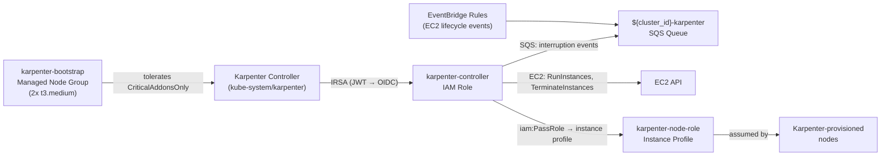

# Karpenter Node Provisioning

**Last Updated Date**: 2026-07-08

## Summary

All EKS clusters use OSS Karpenter v1 (1.13.0) for node provisioning. A dedicated
`karpenter-bootstrap` managed node group provides stable capacity for the Karpenter controller.
The Karpenter controller IAM role uses IRSA (IAM Roles for Service Accounts) rather than EKS Pod
Identity because Karpenter predates EKS Pod Identity GA support.

## Context

When clusters migrated from EKS Auto Mode to OSS Karpenter, two IAM authentication mechanisms
were available for the Karpenter controller ServiceAccount:

- **IRSA (IAM Roles for Service Accounts)**: ServiceAccount carries an annotation
  (`eks.amazonaws.com/role-arn`); the OIDC provider validates the JWT and assumes the annotated
  role. Requires an OIDC provider resource (`aws_iam_openid_connect_provider`) per cluster.
- **EKS Pod Identity**: Newer mechanism; IAM role is bound to a ServiceAccount via an API
  association (no annotation needed). Simpler Terraform — no OIDC provider resource required.

## Decision: IRSA for Karpenter Controller

**Chosen**: IRSA for the Karpenter controller; EKS Pod Identity for all other workloads.

**Rationale**: Karpenter v1 (1.13.0) ships with built-in IRSA support (ServiceAccount annotation
set during `helm install` via `serviceAccount.annotations`). EKS Pod Identity support in Karpenter
requires a separate admission webhook and additional configuration that the upstream chart does not
handle automatically. Using IRSA for Karpenter matches the upstream recommended installation
pattern, minimizes bootstrap complexity, and avoids a separate admission controller dependency
during the ECS bootstrap task.

All other platform workloads (Thanos, Loki, Maestro Agent, AWS Load Balancer Controller, ZOA
jobs) use EKS Pod Identity exclusively.

## Architecture

## IAM Resources

### Karpenter Controller Role (IRSA)

- **Name**: `${cluster_id}-karpenter-controller`
- **Trust**: OIDC provider for the cluster; constrained to `system:serviceaccount:kube-system:karpenter`
- **Permissions**: EC2 fleet operations (describe, run, terminate instances), IAM PassRole to the
  node instance profile, SQS receive/delete on the interruption queue

### Karpenter Node Role

- **Name**: `${cluster_id}-karpenter-node-role`
- **Managed policies**: `AmazonEKSWorkerNodePolicy`, `AmazonEKS_CNI_Policy`, ECR pull-only
- **Optional inline policy**: `kms:Decrypt` and `kms:CreateGrant` on the FIPS AMI KMS key when
  `ami_kms_key_arn` is set
- **Referenced in**: `EC2NodeClass.spec.role`

### SQS Queue and EventBridge Rules

The `eks-cluster` module provisions:

- SQS queue (`${cluster_id}-karpenter`) with SQS-managed SSE, allowing `events.amazonaws.com`
  and `sqs.amazonaws.com` to send messages
- Four EventBridge rules forwarding EC2 events to the queue:
  - `scheduled-change` (AWS Health events)
  - `spot-interruption` (EC2 Spot Instance interruption)
  - `rebalance` (EC2 Instance Rebalance Recommendation)
  - `instance-state-change` (EC2 Instance State-change Notification)

## Consequences

### Positive

- IRSA is the upstream-recommended Karpenter auth mechanism; no additional admission controllers required
- Karpenter controller role trust policy is scoped to a single ServiceAccount — no broader cluster-level access
- SQS interruption handling enables graceful draining before spot reclamation or instance retirement
- OSS Karpenter can be upgraded independently via Helm without AWS EKS Auto Mode release cycles

### Negative

- One OIDC provider resource (`aws_iam_openid_connect_provider`) is required per cluster when `enable_karpenter = true`
- IRSA and Pod Identity coexist; operators must know which mechanism applies to which workload (Karpenter = IRSA, everything else = Pod Identity)

## Related

- [FIPS-Only EKS Compute](./fips-eks-compute.md) — EC2NodeClass and NodePool design for FIPS workloads
- [ECS Fargate Bootstrap](./fully-private-eks-bootstrap.md) — How Karpenter is installed during cluster bootstrap
- [Karpenter documentation](https://karpenter.sh/docs/)
- [IRSA documentation](https://docs.aws.amazon.com/eks/latest/userguide/iam-roles-for-service-accounts.html)
