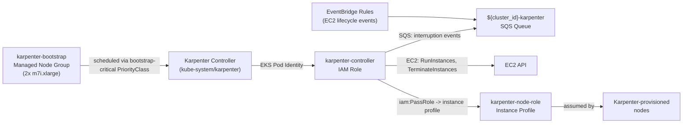

# Karpenter Node Provisioning

**Last Updated Date**: 2026-08-17

## Summary

All EKS clusters use self-managed Karpenter for node provisioning. A dedicated
`karpenter-bootstrap` managed node group (2x m7i.xlarge) provides stable capacity for the Karpenter
controller and ArgoCD (t3.medium -> t3.large -> m7i.xlarge, sized up to give ArgoCD HA replicas and
the redis-ha subchart room to schedule).
The Karpenter controller IAM role uses EKS Pod Identity, consistent with all other platform
workloads.

## Context

When clusters migrated from EKS Auto Mode to self-managed Karpenter, two IAM authentication mechanisms
were available for the Karpenter controller ServiceAccount:

- **IRSA (IAM Roles for Service Accounts)**: ServiceAccount carries an annotation
  (`eks.amazonaws.com/role-arn`); the OIDC provider validates the JWT and assumes the annotated
  role. Requires an OIDC provider resource (`aws_iam_openid_connect_provider`) per cluster.
- **EKS Pod Identity**: Newer mechanism; IAM role is bound to a ServiceAccount via an API
  association (`aws_eks_pod_identity_association`). No annotation or OIDC provider required.

## Decision: EKS Pod Identity for Karpenter Controller

**Chosen**: EKS Pod Identity for the Karpenter controller and all other workloads.

**Rationale**: EKS Pod Identity is the AWS-recommended mechanism for new workloads and the ZOA
platform standard. It eliminates the per-cluster OIDC provider resource and the need to thread a
role ARN through the ECS bootstrap pipeline into ArgoCD cluster secret annotations and
ApplicationSet valuesObject. The Karpenter controller role is bound to `kube-system/karpenter` via
`aws_eks_pod_identity_association` in Terraform, and the Helm chart requires no
`serviceAccount.annotations` configuration.

The initial implementation used IRSA because Karpenter shipped with built-in IRSA support via the
`serviceAccount.annotations` Helm value. Pod Identity was adopted to unify all workloads on a
single IAM mechanism and simplify the infrastructure pipeline.

## Architecture

```mermaid
graph LR
    KC["Karpenter Controller\n(kube-system/karpenter)"] -->|"EKS Pod Identity"| KCR["karpenter-controller\nIAM Role"]
    KCR -->|"SQS: interruption events"| SQS["${cluster_id}-karpenter\nSQS Queue"]
    KCR -->|"EC2: RunInstances, TerminateInstances"| EC2["EC2 API"]
    KCR -->|"iam:PassRole -> instance profile"| KNR["karpenter-node-role\nInstance Profile"]
    KNR -->|"assumed by"| KN["Karpenter-provisioned\nnodes"]
    BNG["karpenter-bootstrap\nManaged Node Group\n(2x m7i.xlarge)"] -->|"scheduled via bootstrap-critical PriorityClass"| KC
    EB["EventBridge Rules\n(EC2 lifecycle events)"] --> SQS
```

## IAM Resources

### Karpenter Controller Role (Pod Identity)

- **Name**: `${cluster_id}-karpenter-controller`
- **Trust**: `pods.eks.amazonaws.com` service principal with `sts:AssumeRole` and `sts:TagSession`
- **Association**: `aws_eks_pod_identity_association` binding `kube-system/karpenter` to the role
- **Permissions**: EC2 fleet operations (describe, run, terminate instances), IAM PassRole to the
  node role, SQS receive/delete on the interruption queue, `eks:DescribeCluster`,
  `ssm:GetParameter` (AMI alias resolution), `pricing:GetProducts`
- **Optional inline policy**: `kms:CreateGrant` (scoped to AWS service principals via
  `kms:GrantIsForAWSResource`) and `kms:DescribeKey` on the FIPS AMI KMS key when
  `ami_kms_key_arn` is set -- lets EC2 decrypt the RHEL FIPS AMI's encrypted EBS snapshot on
  instance launch

### Karpenter Node Role

- **Name**: `${cluster_id}-karpenter-node-role`
- **Managed policies**: `AmazonEKSWorkerNodePolicy`, `AmazonEKS_CNI_Policy`,
  `AmazonEC2ContainerRegistryPullOnly`, `AmazonSSMManagedInstanceCore`
- **Referenced in**: `EC2NodeClass.spec.instanceProfile` (a pre-created instance profile ARN,
  rather than `spec.role`, to avoid the Karpenter controller needing `iam:CreateInstanceProfile`)

### SQS Queue and EventBridge Rules

The `eks-cluster` module provisions:

- SQS queue (`${cluster_id}-karpenter`) with SQS-managed SSE, allowing `events.amazonaws.com`
  to send messages
- Four EventBridge rules forwarding EC2 events to the queue:
  - `spot-interruption` (EC2 Spot Instance Interruption Warning)
  - `instance-terminated` (EC2 Instance State-change Notification, filtered to `state=terminated`)
  - `rebalance-recommendation` (EC2 Instance Rebalance Recommendation)
  - `health-scheduled-change` (AWS Health scheduled-change events for EC2)

## Consequences

### Positive

- All workloads use EKS Pod Identity -- single IAM mechanism across the platform
- No per-cluster OIDC provider resource required, reducing Terraform surface area
- Role ARN no longer threaded through ECS bootstrap -> cluster secret annotation -> ApplicationSet valuesObject pipeline
- Karpenter controller role trust policy is scoped to `pods.eks.amazonaws.com` with a Pod Identity association binding it to a single ServiceAccount
- SQS interruption handling enables graceful draining before spot reclamation or instance retirement
- Self-managed Karpenter can be upgraded independently via Helm without AWS EKS Auto Mode release cycles

### Negative

- Pod Identity requires the EKS Pod Identity Agent addon (installed as an EKS managed addon)
- The Karpenter Helm chart's `serviceAccount.annotations` value is unused; IAM binding is managed entirely in Terraform

## Related

- [FIPS-Only EKS Compute](./fips-eks-compute.md) -- EC2NodeClass and NodePool design for FIPS workloads
- [ECS Fargate Bootstrap](./fully-private-eks-bootstrap.md) -- How Karpenter is installed during cluster bootstrap
- [Karpenter documentation](https://karpenter.sh/docs/)
- [EKS Pod Identity documentation](https://docs.aws.amazon.com/eks/latest/userguide/pod-identities.html)
