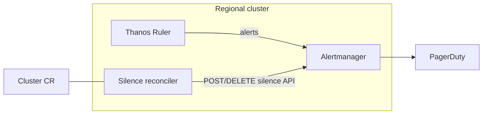

# Lifecycle alert silencing for HyperFleet

**Last Updated Date**: 2026-08-17

## Summary

Replace PromQL `unless` lifecycle exclusions in regional alert rules with **Alertmanager silences** managed by a **stateless HyperFleet silence reconciler** that watches `Cluster` resources and writes to the **regional cluster (RC) Alertmanager** using the Alertmanager v2 silence API (`POST /api/v2/silences`, `DELETE /api/v2/silence/{silenceID}`).

## Context

- **Problem Statement**: Install/delete suppression is embedded in every SLA alert expression (`unless on(namespace, name, cluster) (hcp:lifecycle_installing or hcp:lifecycle_deleting)` — [hcp-sla.yaml](../../argocd/config/regional-cluster/alerting-rules/templates/hcp-sla.yaml)). Each new alert must remember the wrapper; new reasons (limited support, maintenance) require more recording rules; lifecycle logic lives in metrics instead of the control plane that already owns cluster state.
- **Constraints**: Evaluation and paging run on the RC ([alerting architecture](alerting-architecture.md)); silences must scope per HostedCluster; install-timeout alerts must remain fireable during install ([hcp-installation.yaml](../../argocd/config/regional-cluster/alerting-rules/templates/hcp-installation.yaml)).
- **Assumptions**: Control plane is **hyperfleet-operator** + **hyperfleet-db** ([regional architecture](regional-control-plane-architecture.md)); MVP talks to in-cluster RC Alertmanager over Kubernetes `Service` DNS.

Prior RHOBS direction prefers **Alertmanager silence API + an external lifecycle caller** over PromQL wrappers ([Observatorium silence API #904](https://github.com/observatorium/api/pull/904), [OpenAPI spec](https://github.com/observatorium/api/blob/main/client/spec.yaml)).

## Alternatives Considered

1. **Keep / expand PromQL `unless` wrappers**: Rejected — does not scale as alert and lifecycle-reason cardinality grows.
2. **Embed silence logic in the main hyperfleet-operator reconciler**: Rejected — couples paging policy to the primary reconcile loop; harder to test and operate independently.
3. **Persist silence IDs in hyperfleet-db**: Rejected — couples correctness to two stores; Alertmanager list + Cluster CR diff is sufficient.
4. **Customer-facing silence API**: Out of scope — privileged ops remain mediated via ZOA.

## Design Rationale

- **Justification**: `Cluster` status already carries lifecycle phase and conditions. A dedicated reconciler maps that signal to Alertmanager silences so alert rules only express SLO logic.
- **Comparison**: PromQL suppression duplicates state and drifts; API silences are the standard Alertmanager mechanism and align with upstream RHOBS API work.

## Design

### Components



**Principle:** PromQL answers whether an SLO is burning; silences answer whether humans should be notified for a given cluster right now.

### Reconciler ownership and sharding

Add a **dedicated, stateless silence reconciler** (controller-runtime) that:

1. Uses `For(&v1alpha1.Cluster{})` — the same pattern as `ClusterReconciler` and `PlacementReconciler` — so it plugs into the existing **namespace sharding model** with no new watches.
2. Derives desired silences from the cluster's `.Status.Phase` and conditions. **MVP:** `installing` and `deleting` only; `limited_support` and `maintenance` follow once per-state exemption policies are defined.
3. Each reconcile:
   - **List** silences from Alertmanager with `GET /api/v2/silences?filter=<cluster label matchers>&expired=false` (the API accepts label-matcher filters, not `createdBy`).
   - **Filter locally** to silences where `createdBy=hyperfleet-silence-reconciler` and the structured comment matches the owner key (`cluster=<id>;reason=<lifecycle_reason>`).
   - Ignore any returned silence with `status.state=expired` even if present.
   - **Diff** against the desired set, then create, renew, or expire.
   - For orphan cleanup, also list owned silences for clusters that recently left the shard (including deleted clusters) and expire any not in the desired set.

**Sources of truth:**

- **Cluster CR** → what silences _should_ exist
- **Alertmanager** → what silences _do_ exist

No third store. No persisted silence IDs, intent hashes, or `endsAt` in hyperfleet-db.

Each desired silence is keyed by `(cluster_id, lifecycle_reason)` with `createdBy=hyperfleet-silence-reconciler` and a structured comment. If a prior `Create` succeeded but the reconciler crashed before finishing, the next reconcile's Alertmanager `List` sees the existing silence and skips creation.

**Orphan / drift handling:** Any silence from `createdBy=hyperfleet-silence-reconciler` matching a cluster that is **not** in the desired set for that reconcile gets expired. The normal reconcile loop handles orphans — no separate startup scan or DB-vs-AM comparison.

### Lifecycle states

| State             | Meaning                                                                                                                         | MVP |
| ----------------- | ------------------------------------------------------------------------------------------------------------------------------- | --- |
| `installing`      | Cluster provisioning in progress                                                                                                | Yes |
| `deleting`        | Cluster teardown in progress                                                                                                    | Yes |
| `limited_support` | Cluster marked limited support — **platform-api** writes the condition; **hyperfleet-operator** projects it to `Cluster` status | No  |
| `maintenance`     | Planned SRE maintenance window — **platform-api** sets the maintenance condition; operator projects to `Cluster` status         | No  |

`limited_support` and `maintenance` are out of MVP until per-state exemption matchers are approved (see below). The reconciler reads only `Cluster` status — never a separate flag source.

### Lifecycle behavior

- **Enter silencable state** → `POST /api/v2/silences` with TTL (skip if matching owned silence already exists).
- **While state persists** → renew before expiry via `POST /api/v2/silences` with the existing silence `id` and updated `endsAt`.
- **Leave state** → `DELETE /api/v2/silence/{silenceID}`.
- **Ambiguous API responses** → bounded retries; next reconcile re-lists from Alertmanager before creating.

Suggested TTLs (each renewal sets `endsAt = now + renewal_window`):

| Reason                    | Initial window   | Renew when remaining  | Renewal window                               |
| ------------------------- | ---------------- | --------------------- | -------------------------------------------- |
| `installing` / `deleting` | 6h               | < 1h                  | 6h                                           |
| `limited_support`         | 24h              | < 4h                  | 24h                                          |
| `maintenance`             | Until window end | < 30m before `endsAt` | Extend to window end, or +4h if no fixed end |

Example for install: cluster enters `installing` at T0 → silence `endsAt = T0 + 6h`. At T0+5h15m (< 1h left) the reconciler POSTs the same `id` with `endsAt = now + 6h`. Repeats until the cluster leaves `installing`, then DELETE.

### Matchers and exemptions

Scope silences on alert identity labels already on SLA rules: `namespace`, `name`, `cluster`.

**MVP exemption (installing):** use an explicit Alertmanager negative matcher — `alertname` / `HCPInstallTimeout15m` / `isEqual: false` / `isRegex: false` — not shorthand `!=` syntax.

```json
{
  "name": "alertname",
  "value": "HCPInstallTimeout15m",
  "isRegex": false,
  "isEqual": false
}
```

| Lifecycle state | Silence? (MVP) | Exemption notes                                                |
| --------------- | -------------- | -------------------------------------------------------------- |
| Installing      | Yes            | Exclude install-timeout alert via negative `alertname` matcher |
| Deleting        | Yes            | No additional exemptions identified for MVP                    |
| Limited support | No (post-MVP)  | Requires billing/security-critical exemption policy            |
| Maintenance     | No (post-MVP)  | Requires per-window exemption policy                           |
| Available       | No             | —                                                              |

**Label contract (migration gate):** SLA burn-rate alerts must carry `namespace`, `name`, and `cluster` labels (already true for [hcp-sla.yaml](../../argocd/config/regional-cluster/alerting-rules/templates/hcp-sla.yaml)). A `promtool` check (or equivalent CI rule lint) validating these labels on all SLA rules **must pass before the dual-run period ends** and `unless` is removed.

### Client abstraction

```go
type SilenceClient interface {
    List(ctx context.Context, matchers ...Matcher) ([]Silence, error)
    Create(ctx context.Context, s PostableSilence) (id string, err error) // create; include id to update/renew
    Expire(ctx context.Context, id string) error                            // DELETE /api/v2/silence/{id}
}
```

MVP implementation uses in-cluster Alertmanager v2 HTTP.

### Migration

1. Ship reconciler; dual-run PromQL `unless` + API silences for one release.
2. **Migration gates (required before removing `unless`):**
   - `promtool` / CI check: every SLA burn-rate alert defines `namespace`, `name`, and `cluster`.
   - Synthetic-alert tests against Alertmanager: for each MVP lifecycle state and transition, confirm eligible alerts are silenced and exempt alerts (install-timeout) still notify — validates matchers, renewal, and expiry. Silence-presence e2e alone is insufficient while `unless` is still active.
3. Remove `unless` from SLA alert expressions. Keep lifecycle recording rules if dashboards still need them.
4. Add `limited_support` / `maintenance` intents after exemption policies are approved.

## Consequences

### Positive

- Lifecycle suppression decoupled from individual alert expressions
- New lifecycle reasons do not require editing every PromQL rule
- Stateless reconciler — no silence bookkeeping in hyperfleet-db
- Aligns with RHOBS Alertmanager silence API direction

### Negative

- Additional reconciler to deploy and monitor
- Silence drift possible if reconciler or Alertmanager is unavailable — mitigated by TTL and reconcile loops

## Cross-Cutting Concerns

### Security

- Dedicated reconciler **ServiceAccount** and **NetworkPolicy** restricting Alertmanager API access to reconciler pods only
- No customer-facing silence write path; ZOA mediates privileged operations

### Reliability

- **Resiliency**: TTL-bound silences; list-and-diff reconcile each pass; dual-run PromQL during migration
- **Observability**: Metrics for active silences, reconcile errors, and renewals

| Risk                              | Mitigation                                                                 |
| --------------------------------- | -------------------------------------------------------------------------- |
| Silence API unavailable at create | Retries; alerting on Alertmanager issues; dual-run PromQL during migration |
| Orphan silence after crash        | TTL expiry; next reconcile expires owned silences not in desired set       |
| Exemption misconfiguration        | Matcher unit tests; per-reason negative `alertname` matchers               |
| Alerts missing identity labels    | Label contract on SLA rules; review on alerting-rules changes              |

## Out of scope

- Customer-facing silence API
- SNS / PagerDuty routing changes
- Silencing on MC-local Prometheus
- Classic OSD clusters (ROSA HCP regional only)

## Future: Observatorium / shared RHOBS API

> **Not part of the MVP.**

The MVP uses **Alertmanager inside the regional cluster**. The **Observatorium tenant silence API** only matters if HyperFleet hosts **full RHOBS per region** as a shared service rather than deploying observability components per RC today — a separate decision, not close in maturity.

If that path is taken later: tenant-scoped silence CRUD ([spec](https://github.com/observatorium/api/blob/main/client/spec.yaml), [#904](https://github.com/observatorium/api/pull/904)); gateway enforcer may require DELETE + POST for renew ([enforcer](https://github.com/observatorium/api/blob/main/api/metrics/v1/alertmanager_enforcer.go)); `SilenceClient` absorbs the transport swap.

## References

- [ROSAENG-62370](https://redhat.atlassian.net/browse/ROSAENG-62370) (spike)
- [ROSAENG-62371](https://redhat.atlassian.net/browse/ROSAENG-62371) (implementation)
