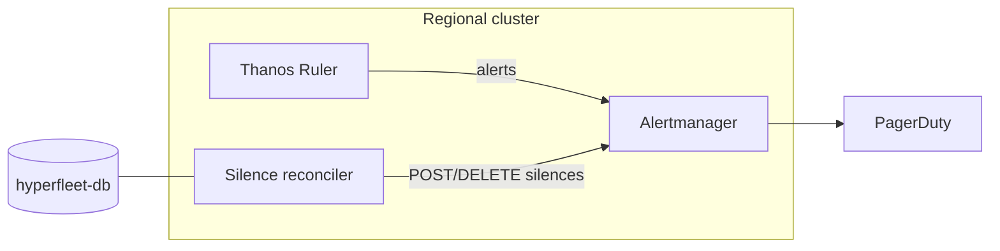

# Lifecycle alert silencing for HyperFleet

## Summary

Replace PromQL `unless` lifecycle exclusions in regional alert rules with **Alertmanager silences** managed by a **HyperFleet silence reconciler**. The reconciler reads cluster lifecycle state from **hyperfleet-db** and creates, renews, and deletes silences on the **regional cluster (RC) Alertmanager**.

**Recommendation:** Proceed. MVP uses in-cluster Alertmanager v2 (`POST`/`DELETE /api/v2/silences`). Dual-run with existing PromQL during rollout, then remove `unless` from alert expressions.

Control plane context: **hyperfleet-operator** + **hyperfleet-db** ([regional architecture](regional-control-plane-architecture.md)).

## Problem

Today, install/delete suppression is embedded in every SLA alert expression:

```yaml
unless on(namespace, name, cluster) (hcp:lifecycle_installing or hcp:lifecycle_deleting)
```

([source](../argocd/config/regional-cluster/alerting-rules/templates/hcp-sla.yaml))

This does not scale: each new alert must remember the wrapper; new reasons (limited support, maintenance) require more recording rules and PromQL edits; and lifecycle logic lives in metrics instead of the control plane that already owns cluster state.

Prior RHOBS discussion (`#wg-rhobs-2x`, Apr 2026) agreed on **Alertmanager silence API + an external lifecycle caller** rather than PromQL wrappers.

## Current architecture

- **Thanos Ruler** on the RC evaluates `PrometheusRule` CRs against federated RC+MC metrics.
- **RC Alertmanager** routes critical alerts to PagerDuty and fans out via SNS.
- Lifecycle suppression is PromQL-only today; limited support on classic OSD uses a brittle OCM-label → metric → PromQL chain we want to avoid for HCP.

See [alerting architecture](alerting-architecture.md).

## Proposed design

### Components



**Principle:** PromQL answers whether an SLO is burning; silences answer whether humans should be notified for a given cluster right now.

### Ownership

Add a **dedicated silence reconciler** (not embedded in the main operator loop, not a webhook or cron-only job) that:

1. Derives silence **intent** from hyperfleet-db cluster state (`installing`, `deleting`, `limited_support`, `maintenance`).
2. Reconciles Alertmanager silences to that intent.
3. Persists silence IDs and `endsAt` for restart recovery.

### Lifecycle behavior

- **Enter silencable state** → `POST` silence with TTL.
- **While state persists** → renew before expiry (`DELETE` + `POST`; Alertmanager has no update-by-ID).
- **Leave state** → `DELETE` silence ID(s).
- **Controller restart** → list/filter by matchers or persisted IDs and heal drift.

Suggested TTLs: `installing` / `deleting` — 6h initial, renew when <1h left; `limited_support` — 24h / renew at 4h; `maintenance` — window end or 4h.

### Matchers and exemptions

Scope silences on existing alert identity labels: `namespace`, `name`, `cluster`.

**MVP exemption:** negative matcher so `HCPInstallTimeout15m` still fires during install ([installation rules](../argocd/config/regional-cluster/alerting-rules/templates/hcp-installation.yaml)).

Longer-term: label silenceable alerts with `silence_eligible: "true"` and omit on exempt alerts.

| Lifecycle state | Silence? | Notes |
| --- | --- | --- |
| Installing | Yes | Except install-timeout alert |
| Deleting | Yes | TBD for delete-stuck alerts |
| Limited support | Yes | TBD for billing/security criticals |
| Maintenance | Yes | Per-window policy |
| Available | No | — |

### Auth (MVP)

In-cluster **ServiceAccount** + NetworkPolicy to RC Alertmanager. No customer-facing silence write path; ZOA remains the mediation layer for privileged ops.

### Client abstraction

```go
type SilenceClient interface {
    List(ctx context.Context, matchers ...Matcher) ([]Silence, error)
    Create(ctx context.Context, s PostableSilence) (id string, err error)
    Expire(ctx context.Context, id string) error
}
```

MVP implementation talks to in-cluster Alertmanager v2. The interface allows swapping transport later without changing reconciler logic.

### Migration

1. Ship reconciler; dual-run PromQL `unless` + API silences for one release.
2. Validate in e2e: install → silence exists; install-timeout still fires; cluster ready → silence removed.
3. Remove `unless` from SLA alert expressions. Keep lifecycle recording rules if dashboards still need them.

### Key risks

| Risk | Mitigation |
| --- | --- |
| Silence API unavailable at create | Retry, metrics, dual-run PromQL during migration |
| Orphan silence after crash | TTL expiry; heal on startup via list + `createdBy` |
| Exemption misconfiguration | Matcher unit tests; deny-list; e2e for install timeout |
| Alerts missing identity labels | Label contract + CI check |

### Out of scope

- Customer-facing silence API
- SNS / PagerDuty routing changes
- Silencing on MC-local Prometheus (evaluation is on RC Thanos Ruler)
- Classic OSD clusters (ROSA HCP regional only)

### Next steps

1. Implement client + reconciler ([ROSAENG-62371](https://redhat.atlassian.net/browse/ROSAENG-62371)).
2. Add limited support / maintenance intents after install/delete soak.

---

## Future: Observatorium / shared RHOBS API

> **Not part of the MVP.** Included for context only.

The MVP deploys and talks to **Alertmanager inside the regional cluster** — the same v2 silence contract HyperFleet already uses for paging ([alerting architecture](alerting-architecture.md)).

We would only need the **Observatorium tenant silence API** if HyperFleet moves from *deploying observability components per RC* to hosting **RHOBS as a shared regional service** (full RHOBS stack colocated in regional clusters, not just Thanos Ruler + Alertmanager as today). That is a separate platform decision; we are not close to it in maturity or design.

If that path is taken later:

- Observatorium exposes Alertmanager v2 silence CRUD per tenant ([spec](https://github.com/observatorium/api/blob/main/client/spec.yaml), [silence-by-ID PR #904](https://github.com/observatorium/api/pull/904)).
- Paths: `POST/GET /api/metrics/v1/{tenant}/am/api/v2/silences`, `GET/DELETE …/silence/{silenceID}`.
- Tenant enforcer injects tenant matcher, rejects update-by-ID (renew = delete + recreate), requires ≥1 matcher beyond tenant label ([enforcer](https://github.com/observatorium/api/blob/main/api/metrics/v1/alertmanager_enforcer.go)).
- Auth would follow the shared gateway model (SigV4 / OIDC) rather than in-cluster SA.
- The `SilenceClient` abstraction above is intended to absorb that swap without reconciler changes.

Open questions for that future (not blocking MVP): gateway auth choice, rate limits, audit retention, and whether the same client serves classic OSD.
