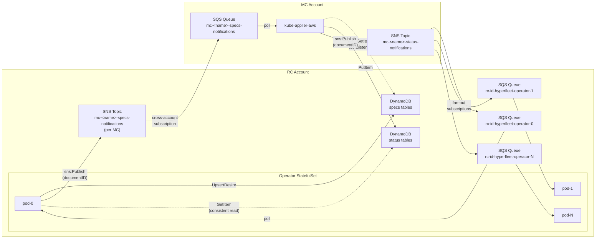
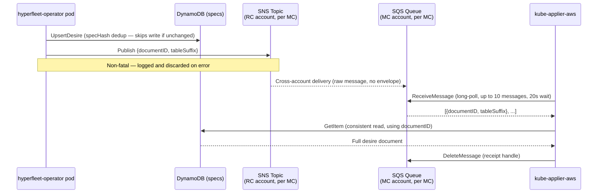
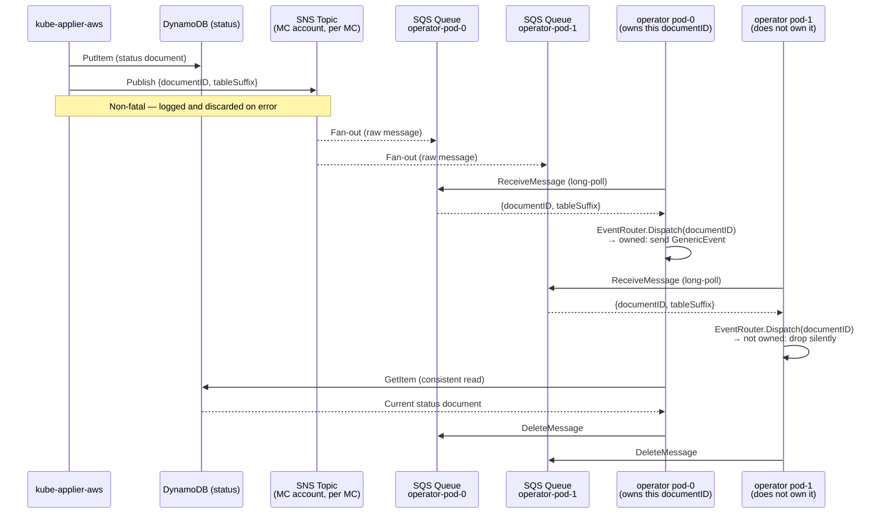

# Scalable DynamoDB Change Notifications via SNS/SQS

**Status**: Accepted
**Decision Date**: 2026-07-27
**Last Updated Date**: 2026-07-27
**Supersedes**: DynamoDB Streams-based `statusstream.Manager` and kube-applier stream watcher

## Summary

This document describes the replacement of DynamoDB Streams with an SNS/SQS fan-out architecture
for bidirectional change notifications between the hyperfleet-operator (RC account) and
kube-applier-aws (MC account). PostgreSQL (via hyperfleet-db) remains the authoritative state
store for Kubernetes resources; DynamoDB holds the desire and status documents that flow between
the operator and kube-applier; SNS/SQS replaces only the wake-up signal that tells each side
when a document has changed. The primary motivation is removing the two-replica ceiling imposed
by DynamoDB Streams' two-consumer-per-stream-shard limit, allowing the hyperfleet-operator
StatefulSet to scale to any number of replicas.

## Context

### Problem Statement

The hyperfleet-operator runs as a Kubernetes StatefulSet and uses DynamoDB Streams to learn when
kube-applier has written a status update. Each operator replica runs a `statusstream.Manager`
that starts one watcher goroutine per MC per status table suffix, polling the stream every second.
DynamoDB Streams enforces a hard limit of **two concurrent consumers per stream shard** — this
limit is absolute and applies across the entire stream, shared by all consumers regardless of how
they are deployed. Because the operator runs multiple controllers (Cluster, NodePool, Manifest),
each with their own stream-watcher goroutine, even a single operator replica can approach or
exceed the two-consumer limit when deployed against multiple MCs. A multi-replica deployment
reliably violates the limit, causing stream throttling and missed events.

kube-applier-aws also tails DynamoDB Streams on the specs tables to detect new or changed desire
documents. Removing this dependency enables future horizontal scaling of kube-applier without
reintroducing the consumer count problem.

Direct DynamoDB polling without Streams is not a viable alternative. Without a native
"changed since" query, each poll cycle requires a full `Scan` of all owned items, comparing
against cached state to find changes. This produces DynamoDB read costs and reconcile loops
proportional to total owned item count rather than actual change rate.

### Constraints

- No VPC peering or PrivateLink between RC and MC accounts. All cross-account calls traverse
  the public AWS API, authenticated via EKS Pod Identity / IRSA.
- Standard (non-FIFO) SQS queues. Message ordering is not required — each notification triggers
  a fresh `GetItem` from DynamoDB, so the order in which notifications arrive is irrelevant.
- All SQS queues and SNS topics are **pre-provisioned by Terraform**, not created at runtime.
  Queue URLs and topic ARNs are passed to the operator and kube-applier as CLI flags or SSM
  parameters. This avoids the need for runtime IAM permissions to create or manage queues.
- SNS publish calls are **non-fatal** on both sides. A publish failure is logged and discarded;
  the 5-minute `RequeueAfter` safety-net poll is the consistency guarantee.
- Raw message delivery (`raw_message_delivery = true`) is configured on all SNS-to-SQS
  subscriptions. Consumers receive the JSON notification body directly, without the SNS envelope
  wrapper.

### Assumptions

- The hyperfleet-operator is deployed as a Kubernetes StatefulSet. Pod hostnames encode the
  replica ordinal (e.g., `hyperfleet-operator-2`), which is used to determine which pre-provisioned
  SQS queue a pod should poll. Every per-pod status SQS queue receives status notifications from
  **all** MCs; each pod uses `EventRouter.Dispatch` to silently drop notifications for document IDs
  it does not own.
- kube-applier-aws is currently leader-elected per MC: only one active replica polls the specs
  SQS queue at a time, so a single specs queue per MC suffices. The SNS/SQS design does not
  preclude future multi-replica kube-applier deployments — additional replicas would require only
  additional SQS queues, mirroring the operator scaling pattern.
- The existing `RequeueAfter: 5m` safety-net poll on all controllers is unchanged and remains
  the correctness guarantee. The SQS notification path is a latency optimisation, not a
  consistency mechanism.

## Alternatives Considered

### 1. Retain DynamoDB Streams

**Approach**: Keep the existing `statusstream.Manager` and stream watcher architecture; accept
the two-replica limit as a permanent constraint.

**Assessment**: Unacceptable for production. Two replicas provides no meaningful redundancy for
a StatefulSet that is the critical path for all cluster and node pool reconciliation. Retaining
Streams forecloses the ability to scale the operator for throughput or availability reasons.

### 2. Amazon EventBridge Pipes

**Approach**: Use EventBridge Pipes as a managed fan-out layer sitting between DynamoDB Streams
and per-consumer SQS queues, removing the consumer count limit while retaining DynamoDB Streams
as the source.

**Assessment**: Reduces implementation complexity by eliminating the in-process SNS publish call,
but retains a dependency on DynamoDB Streams (with its associated cost and operational surface).
Cross-account fan-out via EventBridge requires additional bus configuration. The per-event pricing
model is less predictable than SQS at high document churn rates. Eliminated in favour of the
simpler SNS publish-after-write pattern.

### 3. SNS/SQS Fan-out (Chosen)

**Approach**: The writer (operator or kube-applier) calls `sns:Publish` with the `documentID`
immediately after a successful DynamoDB write. SNS fans out to all subscribed SQS queues. Each
consumer polls only its own queue, then does a targeted `GetItem` for the full document.

**Assessment**: No consumer count limits. Pure push with no Streams dependency. Cross-account
delivery uses standard SNS resource policies — the same IAM pattern already used for cross-account
DynamoDB access. Consumers are fully decoupled: adding a new operator replica requires only
provisioning a new SQS queue and subscribing it to the relevant SNS topics.

## Design

### Architecture Overview

The following diagram shows the complete two-account topology. Both notification directions are
shown: the specs path (RC → MC, triggered by desire writes) and the status path (MC → RC,
triggered by status writes).



**Key architectural points:**

- **RC account** hosts: the operator StatefulSet, the per-MC specs SNS topic (one per MC), one
  status SQS queue per operator pod, and all DynamoDB tables.
- **MC account** hosts: kube-applier-aws, the specs SQS queue (one per MC), and the status SNS
  topic (one per MC).
- **Specs path** flows RC → MC: operator publishes to an RC-account SNS topic; SNS delivers
  cross-account to an MC-account SQS queue; kube-applier polls that queue.
- **Status path** flows MC → RC: kube-applier publishes to an MC-account SNS topic; SNS fans out
  cross-account to all per-pod SQS queues in the RC account; each pod polls only its own queue.
- **DynamoDB** is never polled for change detection after startup. All `GetItem` calls are
  pull-on-demand in response to an SQS notification or the 5-minute safety-net `RequeueAfter`.

---

### Specs Path (Operator → kube-applier)

This path delivers desire change notifications from the hyperfleet-operator to kube-applier-aws.
It replaces kube-applier's DynamoDB Streams watcher on the specs tables.

The following sequence shows a single desire write and its downstream notification:



**Step-by-step walkthrough:**

1. **UpsertDesire** — the operator writes the desire document to DynamoDB using a `specHash`
   deduplication check. If the spec content is unchanged the DynamoDB write is skipped entirely,
   and no SNS notification is published. This prevents spurious kube-applier reconciles on
   no-op operator reconciles.
2. **sns:Publish** — on a successful DynamoDB write the operator calls `sns:Publish` with a
   `SpecNotification` payload containing the `documentID` and `tableSuffix`. This call is
   best-effort: on failure the error is logged and the operator continues. The 5-minute
   `RequeueAfter` poll covers any missed notification.
3. **Cross-account delivery** — SNS delivers the message to the MC-account specs SQS queue via
   a pre-provisioned cross-account subscription. Raw message delivery is enabled so kube-applier
   receives the JSON body directly.
4. **ReceiveMessage** — kube-applier's `sqspoller.Poller` long-polls the queue (20-second wait,
   up to 10 messages per call). The poller is started after the informer cache sync so the
   startup full `Scan` wave completes before incremental SQS notifications are processed.
5. **Route by tableSuffix** — the poller inspects the `tableSuffix` field and routes the
   `documentID` to either `enqueueApply` (suffix contains `"applydesires"`) or `enqueueRead`
   (suffix contains `"readdesires"`). Unknown suffixes are logged and discarded.
6. **GetItem** — the relevant controller dequeues the `documentID` and performs a consistent
   `GetItem` to read the current full spec from DynamoDB.
7. **DeleteMessage** — the poller deletes the SQS message after enqueue. If the process crashes
   before deletion, the message reappears after the 30-second visibility timeout and is
   re-delivered. Enqueue is idempotent.

**Note on startup:** kube-applier still performs a full `Scan` of all specs tables on startup to
populate its in-memory store. SQS handles only incremental change notifications after that point.

---

### Status Path (kube-applier → Operator)

This path delivers status change notifications from kube-applier-aws to the hyperfleet-operator.
It replaces the operator's `statusstream.Manager` and its per-MC, per-table-suffix stream watcher
goroutines — the component that imposed the two-replica limit.



**Step-by-step walkthrough:**

1. **PutItem** — kube-applier writes the status document to DynamoDB unconditionally (no
   `ConditionExpression` on the status write) so that a desire updated to `Type=Delete` with a
   newer `updateTime` always produces a fresh status the operator will accept.
2. **sns:Publish** — kube-applier's `statussnspublisher.Publisher` calls `sns:Publish` with a
   `StatusNotification` payload. The `--sns-status-topic-arn` flag is optional; if absent,
   publish is skipped. All publish failures are logged and discarded by the `notifyingCRUD`
   wrapper — the call is outside the DynamoDB write transaction and must never cause a status
   write to fail.
3. **Fan-out** — the MC-account SNS topic delivers the message cross-account to every per-pod
   status SQS queue subscribed to it. Each operator pod receives every status notification from
   every MC.
4. **ReceiveMessage** — each pod's `statussqsconsumer.Consumer` long-polls its own pre-assigned
   SQS queue (URL passed via `--sqs-status-queue-url`, which is **required**). Up to 10 messages
   per call, 20-second long-poll wait.
5. **EventRouter.Dispatch** — for each message the consumer calls `onDocumentID`, which invokes
   `EventRouter.Dispatch(documentID)`. The EventRouter looks up the `documentID` in its internal
   map. If this pod owns it, it sends a `GenericEvent` to the controller's `StatusEvents` channel
   (capacity 256). If this pod does not own the document ID the event is dropped silently —
   no filtering is required in the consumer itself.
6. **GetItem** — the owning controller reconciles: it calls `GetItem` with `ConsistentRead: true`
   to read the current status document.
7. **DeleteMessage** — the consumer deletes the SQS message after dispatching. Re-delivery on
   crash is handled by the 30-second visibility timeout; a re-dispatched event causes a harmless
   redundant reconcile.

**EventRouter** is unchanged from the previous design. During reconcile, controllers register
document IDs they own:

```go
r.EventRouter.Register(docID, EventTarget{
    Channel: r.StatusEvents,
    Key:     req.NamespacedName,
})
```

On CR deletion, controllers deregister:

```go
r.EventRouter.Deregister(docID)
```

The `documentID` is deterministic (UUID v5 derived from `taskKey/group/version/resource/namespace/name`),
so the controller that created a desire always owns its status notifications.

---

### Message Format

Both notification directions use the same JSON structure:

```json
{
  "documentID": "a1b2c3d4-e5f6-7890-abcd-ef1234567890",
  "tableSuffix": "specs-applydesires"
}
```

| Field         | Description                                                                                                                                                                                                                                                    |
| ------------- | -------------------------------------------------------------------------------------------------------------------------------------------------------------------------------------------------------------------------------------------------------------- |
| `documentID`  | The UUID v5 document identifier. Globally unique across all table types.                                                                                                                                                                                       |
| `tableSuffix` | Identifies which DynamoDB table the document lives in. The consumer uses this to route to the correct controller queue (kube-applier) or for logging context (operator). Examples: `specs-applydesires`, `specs-readdesires`, `-applydesires`, `-readdesires`. |

The `SpecNotification` type (operator → kube-applier, in `snspublisher`) and the
`StatusNotification` type (kube-applier → operator, in `statussnspublisher`) are structurally
identical but semantically distinct — they are defined separately in each package to avoid a
shared-library dependency between the two services.

Raw message delivery is enabled on all SNS-to-SQS subscriptions. Consumers unmarshal the body
directly without stripping an SNS envelope.

---

### Infrastructure Provisioning

All SQS queues and SNS topics are provisioned by Terraform before the operator or kube-applier
starts. Neither service creates or manages messaging resources at runtime.

Two Terraform modules provide the messaging infrastructure:

#### `kube-applier-rc-messaging` (RC account, one instantiation per MC)

Provisions:

- **Specs SNS topic** — `${mc_name}-specs-notifications`. The operator publishes here after every
  desire write. Subscribed to the MC-side specs SQS queue via a cross-account SNS subscription.
- **Status SQS queues** — `${rc_id}-hyperfleet-operator-{0..N-1}`, one per operator replica
  (`operator_replica_count`, default 3, max 10). Each queue is independently subscribed to the
  MC-account status SNS topic.
- **KMS key** — shared encryption key for all RC-side messaging resources for this MC, with
  grants for `sns.amazonaws.com` and `sqs.amazonaws.com` service principals.
- **IAM inline policy** — `${mc_name}-messaging-access` attached to the shared
  `${rc_id}-hyperfleet-operator` role. Grants `sns:Publish` on the specs topic and
  `sqs:ReceiveMessage`, `sqs:DeleteMessage`, `sqs:GetQueueAttributes` on all status queues.
  Also grants `kms:GenerateDataKey*` (required to publish encrypted SNS messages) and
  `kms:Decrypt` (required to receive and decrypt SQS messages) on the RC-side KMS key.
  Follows the same incremental per-MC policy pattern as the existing DynamoDB access policies,
  so parallel per-MC Terraform state files never collide.
- **SSM parameter** — `/${rc_id}/${mc_name}/messaging/specs-topic-arn` for operator configuration.

Queue settings: `message_retention_seconds = 300` (5 minutes, aligned to safety-net poll
interval), `visibility_timeout_seconds = 30`, `receive_wait_time_seconds = 20` (long-poll).

#### `kube-applier-mc-messaging` (MC account, one instantiation per MC)

Provisions:

- **Specs SQS queue** — `${mc_name}-specs-notifications`. kube-applier polls this queue. The
  RC-account specs SNS topic is subscribed to it via cross-account subscription.
- **Status SNS topic** — `${mc_name}-status-notifications`. kube-applier publishes here after
  every status write. Subscribed by all RC-side per-pod SQS queues.
- **KMS key** — shared MC-side messaging key.
- **IAM inline policy** — grants kube-applier role `sqs:ReceiveMessage`, `sqs:DeleteMessage`,
  `sqs:GetQueueAttributes` on the specs queue and `sns:Publish` on the status topic.
  Also grants `kms:Decrypt` (required to receive and decrypt SQS messages) and
  `kms:GenerateDataKey*` (required to publish encrypted SNS messages) on the MC-side KMS key.
- **SSM parameters** — `/${mc_name}/messaging/specs-queue-url` and
  `/${mc_name}/messaging/status-topic-arn`.

#### Bootstrapping guard

Both RC and MC messaging modules are conditionally instantiated in their respective config roots.
The RC `kube-applier-dynamodb-provisioning` config applies `kube-applier-rc-messaging` only when
both `mc_status_sns_topic_arn` and `mc_specs_queue_arn` are non-empty, allowing messaging to be
added to an existing environment without disrupting it on the first apply.

---

### Cross-Account IAM

All cross-account access uses SNS and SQS resource policies — no VPC peering or PrivateLink is
required.

#### Specs path (RC SNS → MC SQS)

The RC specs SNS topic policy allows the hyperfleet-operator role to publish:

```json
{
  "Effect": "Allow",
  "Principal": {
    "AWS": "arn:aws:iam::RC_ACCOUNT:role/rc-id-hyperfleet-operator"
  },
  "Action": "sns:Publish",
  "Resource": "arn:aws:sns:REGION:RC_ACCOUNT:mc-name-specs-notifications"
}
```

The MC specs SQS queue policy allows the RC SNS topic to deliver messages:

```json
{
  "Effect": "Allow",
  "Principal": { "Service": "sns.amazonaws.com" },
  "Action": "sqs:SendMessage",
  "Resource": "arn:aws:sqs:REGION:MC_ACCOUNT:mc-name-specs-notifications",
  "Condition": {
    "ArnEquals": {
      "aws:SourceArn": "arn:aws:sns:REGION:RC_ACCOUNT:mc-name-specs-notifications"
    }
  }
}
```

#### Status path (MC SNS → RC SQS)

The MC status SNS topic policy allows the kube-applier role to publish, and the RC account root
to manage subscriptions:

```json
{
  "Effect": "Allow",
  "Principal": {
    "AWS": "arn:aws:iam::MC_ACCOUNT:role/kube-applier-role"
  },
  "Action": "sns:Publish",
  "Resource": "arn:aws:sns:REGION:MC_ACCOUNT:mc-name-status-notifications"
}
```

Each RC status SQS queue policy allows the MC SNS topic to deliver:

```json
{
  "Effect": "Allow",
  "Principal": { "Service": "sns.amazonaws.com" },
  "Action": "sqs:SendMessage",
  "Resource": "arn:aws:sqs:REGION:RC_ACCOUNT:rc-id-hyperfleet-operator-N",
  "Condition": {
    "ArnEquals": {
      "aws:SourceArn": "arn:aws:sns:REGION:MC_ACCOUNT:mc-name-status-notifications"
    }
  }
}
```

KMS key policies on both sides include grants for `sns.amazonaws.com` and `sqs.amazonaws.com`
so that cross-account encrypted delivery works without additional cross-account KMS access.

---

### Reliability

#### Notification path (fast path)

SQS guarantees at-least-once delivery. A message remains in the queue until the consumer
explicitly deletes it via `DeleteMessage`. If a consumer process crashes between receiving a
message and deleting it, the message becomes visible again after the 30-second visibility
timeout and is re-delivered. Re-delivery causes a harmless redundant reconcile — all operator
controllers are idempotent.

#### Safety-net polling (consistency guarantee)

Every successful controller reconcile returns `RequeueAfter: 5m`. The controller re-reads
status directly from DynamoDB with a consistent read regardless of how the reconcile was
triggered. This covers:

- SNS publish failures (best-effort, non-fatal on both sides)
- SQS delivery failures (extremely rare — SQS is highly available)
- EventRouter channel-full drops (channel capacity 256; dropped events are logged)
- Registration races — an SQS notification arriving before the controller has called
  `Register(docID)` produces a silent `Lookup` miss; the in-progress re-list reconcile
  already handles this CR

The 5-minute safety-net is the correctness guarantee. The SQS notification path is a latency
optimisation that drives reconciles to near-real-time without the Streams consumer limit.

#### No DLQ

A dead-letter queue is not warranted. SQS messages contain only a `documentID` string — there
is no business logic embedded in the message that needs recovery. Any document a missed
notification would have triggered is already covered by the 5-minute safety-net poll. Adding a
DLQ would create an operational burden (alarm, drain procedure) with no meaningful benefit.

---

### Startup Behaviour

1. **SQS queue URL** is a pre-provisioned CLI flag (`--sqs-status-queue-url` on the operator,
   `--sqs-specs-queue-url` on kube-applier). No runtime queue creation occurs.
2. **EventRouter** starts empty. No `documentID` mappings exist at process start.
3. **Informer re-list** — controller-runtime re-lists all owned CRs from PostgreSQL on startup,
   triggering a reconcile for each. Each reconcile calls `Register(docID, target)`, populating
   the EventRouter, and performs a consistent `GetItem` to read current DynamoDB state.
4. **SQS drain** — the consumer begins polling immediately. Messages that arrived during a
   prior downtime are available in the queue. Notifications for document IDs not yet registered
   by the re-list wave produce silent `Lookup` misses in the EventRouter; those CRs are already
   being reconciled by the re-list and no event is lost.
5. **Steady state** — after the re-list wave completes, the EventRouter is fully populated and
   SQS notifications trigger immediate targeted reconciles.

## Consequences

### Positive

- **No replica limit** — the hyperfleet-operator StatefulSet can scale to any number of replicas.
  Each additional pod requires only one additional pre-provisioned SQS queue.
- **No DynamoDB Streams dependency** — the `DynamoDBStreams` API is no longer called at runtime.
  Stream shard limits, shard split behaviour, and iterator expiry are no longer operational
  concerns.
- **Low-latency notifications** — status changes reach the operator near-real-time (typically
  sub-second when a message is present) rather than at the next safety-net poll interval. The
  20-second long-poll `WaitTimeSeconds` is the maximum wait when the queue is empty, not the
  expected end-to-end delivery latency.
- **Independently deployable** — the Terraform bootstrapping guard allows messaging to be
  added to an existing environment on a subsequent apply without disrupting running services.
- **Simple fan-out** — adding a new operator replica requires only provisioning a new SQS queue
  and subscribing it to the relevant SNS topics. No application code changes are needed.

### Negative / Trade-offs

- **Two new AWS service dependencies** — SNS and SQS are introduced into the operational
  surface. Both are AWS-managed and highly available, but represent additional services to
  monitor and understand.
- **Terraform complexity** — two new modules (`kube-applier-rc-messaging`,
  `kube-applier-mc-messaging`) and changes to two config roots add per-MC Terraform state
  surface. The bootstrapping guard mitigates rollout risk.
- **Operator requires `--sqs-status-queue-url`** — this flag is required; the operator exits
  on startup if it is absent. Queue URLs must be wired through the operator Helm chart or
  deployment configuration.
- **Every pod receives every notification** — the status fan-out delivers all MC status
  notifications to all operator pods. Pods that do not own the document ID discard the message
  silently after an EventRouter lookup. At low-to-moderate document churn rates this is cheap;
  at very high churn rates the per-pod receive volume scales with the number of MCs.
- **No guaranteed ordering** — standard SQS queues do not preserve message order. This is
  intentional and harmless: each notification triggers a fresh consistent `GetItem` so the
  latest state is always read regardless of delivery order.

## Cross-Cutting Concerns

### Reliability

**Scalability**: SQS imposes no consumer count limit. The operator scales horizontally by
adding pods and queues; the only coordination is Terraform applying the new queue and
subscription before the pod starts.

**Resiliency**: At-least-once SQS delivery with 30-second visibility timeout provides
crash-recovery without operator intervention. The 5-minute safety-net poll is a second
independent consistency path. A complete SQS outage would degrade notification latency to
5 minutes (safety-net interval) but would not cause data loss or incorrect state.

**Observability**: The following SQS CloudWatch metrics are natural health indicators:

- `ApproximateNumberOfMessagesVisible` — queue depth; sustained growth indicates a consumer
  is not keeping up.
- `ApproximateAgeOfOldestMessage` — message age; values approaching the 5-minute retention
  period indicate a lagging or stopped consumer. A CloudWatch alarm with a threshold of 60
  seconds is recommended.
- `NumberOfMessagesSent` and `NumberOfMessagesDeleted` — throughput and delete rate; a
  persistent gap indicates messages not being processed.

### Security

- All SQS queues and SNS topics are encrypted at rest with KMS customer-managed keys.
  KMS key policies include explicit grants for the SNS and SQS service principals to
  support cross-account encrypted delivery.
- IAM permissions follow least privilege: the operator role is granted only `sns:Publish`
  on its specs topic, `sqs:ReceiveMessage`, `sqs:DeleteMessage`, `sqs:GetQueueAttributes`
  on its status queues, and `kms:GenerateDataKey*` / `kms:Decrypt` on the RC-side KMS key.
  kube-applier is granted only `sqs:ReceiveMessage`, `sqs:DeleteMessage`,
  `sqs:GetQueueAttributes` on its specs queue, `sns:Publish` on its status topic, and
  `kms:Decrypt` / `kms:GenerateDataKey*` on the MC-side KMS key.
- All cross-account calls traverse the public AWS API authenticated via EKS Pod Identity.
  No VPC peering, PrivateLink, or network-level trust is required.
- SQS queue policies use `ArnEquals` conditions on `aws:SourceArn` to restrict delivery
  to the specific SNS topic, preventing other principals from injecting messages.

### Performance

- SQS long-polling (`WaitTimeSeconds: 20`) blocks for up to 20 seconds when the queue is
  empty, eliminating the busy-loop behaviour of short-polling. At idle this consumes one
  `ReceiveMessage` API call per 20 seconds per consumer.
- Up to 10 messages are retrieved per `ReceiveMessage` call, batching notifications during
  burst periods.
- `GetItem` with `ConsistentRead: true` is called once per dispatched notification. This is
  the same call that would have been made on the Streams path. A future optimisation
  (`BatchGetItem`) can reduce round-trips when multiple notifications arrive together.
- The 5-second retry delay on SQS errors prevents tight error loops.

### Cost

- **SQS**: first 1 million requests per month are free (account-wide, not per-queue);
  $0.40 per million thereafter. At 10 messages per `ReceiveMessage` call, typical notification
  volumes are well within the free tier across all queues in the account.
- **SNS**: first 1 million publish API calls per month are free; $0.50 per million thereafter.
  SNS-to-SQS message delivery incurs no per-notification fee; standard AWS data transfer rates
  apply for cross-account delivery out of the SNS region.
- **KMS**: one key per MC per account. Key storage is $1/month/key. API call costs are
  negligible at notification volumes.
- **Idle queues**: a queue with no messages and no active consumer incurs no SQS charges.
  Pods that are scaled down leave their queues idle at zero cost. The 5-minute retention
  period bounds any message accumulation during scale-down events.

### Operability

- Queue URLs and topic ARNs are surfaced as SSM parameters by Terraform, making them
  discoverable without inspecting Terraform state directly.
- The `statussqsconsumer` and `sqspoller` components log at `Info` level on start/stop and
  `Error` level on SQS failures, with structured fields (`queueURL`, `err`, `retryDelay`)
  suitable for log aggregation queries.
- Scaling the operator up or down is a Terraform apply (`operator_replica_count`) followed
  by a StatefulSet replica count change. No application code changes are required.
- The bootstrapping guard in the RC config root allows messaging to be introduced to a
  running environment without a maintenance window.

## Future Optimisations

### BatchGetItem

Controllers currently make individual `GetItem` calls per desire status (for example, up to
8 calls per Cluster reconcile). `BatchGetItem` reads up to 100 items in a single call,
significantly reducing DynamoDB round-trips during bursts of SQS notifications. This requires
adding `BatchGetItem` to the `dynamoAPI` interface and updating affected controllers.

### Eventually-consistent reads on the notification path

When a controller reconciles in response to an SQS notification, the status write has already
completed — eventually-consistent reads would return the correct data in virtually all cases.
Dropping `ConsistentRead: true` on the notification-triggered reconcile path would halve the
DynamoDB RCU cost for those reads. The 5-minute safety-net poll should continue using consistent
reads to preserve the correctness guarantee.

## Key File References

| Component        | File                                                                | Description                                                                               |
| ---------------- | ------------------------------------------------------------------- | ----------------------------------------------------------------------------------------- |
| **Terraform**    | `terraform/modules/kube-applier-rc-messaging/`                      | RC-account SNS topics, per-pod SQS queues, KMS key, IAM policy                            |
| **Terraform**    | `terraform/modules/kube-applier-mc-messaging/`                      | MC-account SQS queue, status SNS topic, KMS key, IAM policy                               |
| **Terraform**    | `terraform/config/kube-applier-dynamodb-provisioning/`              | RC config root; conditionally instantiates `kube-applier-rc-messaging`                    |
| **Terraform**    | `terraform/config/management-cluster/`                              | MC config root; conditionally instantiates `kube-applier-mc-messaging`                    |
| **Operator**     | `hyperfleet-operator/internal/dynamo/snspublisher/publisher.go`     | Publishes `SpecNotification` to the per-MC specs SNS topic after desire writes            |
| **Operator**     | `hyperfleet-operator/internal/dynamo/statussqsconsumer/consumer.go` | Long-polls the per-pod status SQS queue; calls `EventRouter.Dispatch`                     |
| **Operator**     | `hyperfleet-operator/internal/dynamo/client.go`                     | `NewClientWithSNS` wires the publisher into `UpsertDesire` / `UpsertReadDesire`           |
| **Operator**     | `hyperfleet-operator/cmd/manager/main.go`                           | Wires `snspublisher`, `statussqsconsumer`, STS account ID resolution, CLI flags           |
| **kube-applier** | `internal/database/sqspoller/poller.go`                             | Long-polls the specs SQS queue; routes by `tableSuffix` to apply or read workqueue        |
| **kube-applier** | `internal/database/statussnspublisher/publisher.go`                 | Publishes `StatusNotification` to the MC status SNS topic after status writes             |
| **kube-applier** | `internal/database/statussnspublisher/notifying_crud.go`            | Generic `ResourceCRUD[T]` wrapper that calls `Publisher.Publish` after `Create`/`Replace` |
