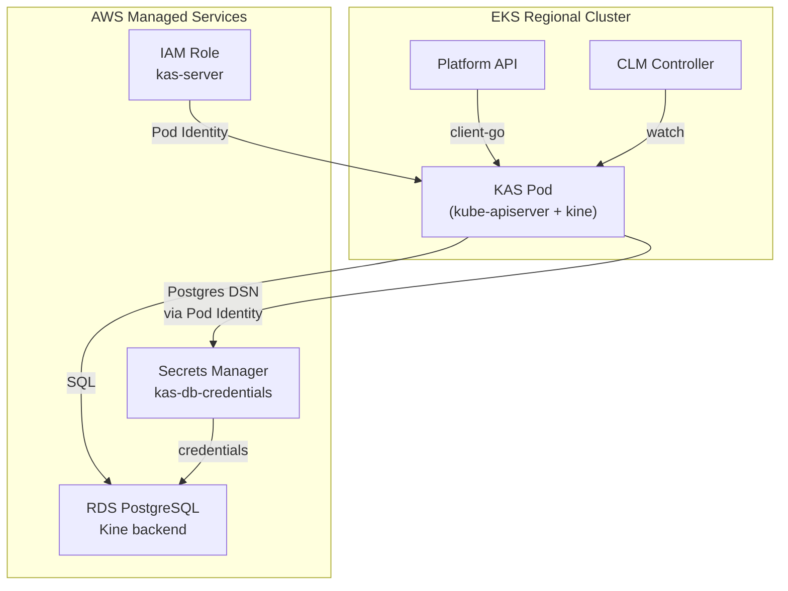

# KAS Infrastructure Module

This Terraform module provisions AWS managed services for the Kubernetes API Server (KAS)
backed by Kine with PostgreSQL storage in the ROSA Regional Platform.

## Overview

KAS is the Kubernetes API Server used as the state store for the Cluster Lifecycle Manager (CLM).
It uses [Kine](https://github.com/k3s-io/kine) as an etcd shim, translating the etcd v3 gRPC API
to PostgreSQL queries against an AWS RDS instance. This replaces HyperFleet's custom REST API
backed by PostgreSQL as the cluster state store.

## Architecture



## Resources Created

### Database (RDS PostgreSQL)

- **Instance**: PostgreSQL 18 on db.t4g.micro (configurable)
- **Storage**: 20 GB gp3, encrypted at rest
- **High Availability**: Single-AZ (development) or Multi-AZ (production)
- **Backups**: 7-day retention, automated snapshots
- **Monitoring**: Performance Insights enabled (7-day retention)
- **Network**: Private subnets only, no public access
- **Security**: TLS required, security group restricts access to EKS cluster

### Secrets Management

- **DB Credentials Secret**: `{regional_id}-kas-db-credentials`
  - Contains: `username`, `password`, `host`, `port`, `database`
  - Consumed by the `kas` Helm chart via SecretProviderClass (ASCP)
- **Recovery**: 0-day recovery window for quick recreation in dev

### IAM Roles (Pod Identity)

1. **kas-server**: Access to database credentials in Secrets Manager
   - Trust policy for `pods.eks.amazonaws.com`
   - Least-privilege access to `kas-db-credentials` secret only
   - Pod Identity association to `kas-sa` in `kas-system` namespace

## Usage

### Basic Configuration (Development)

```hcl
module "kas_infrastructure" {
  source = "../../modules/kas-infrastructure"

  regional_id                           = "regional"
  vpc_id                                = "vpc-xxxxx"
  private_subnets                       = ["subnet-xxxxx", "subnet-yyyyy"]
  eks_cluster_name                      = "regional"
  eks_cluster_security_group_id         = "sg-xxxxx"
  eks_cluster_primary_security_group_id = "sg-yyyyy"
}
```

### Production Configuration

```hcl
module "kas_infrastructure" {
  source = "../../modules/kas-infrastructure"

  # ... required variables ...

  bastion_enabled           = true
  bastion_security_group_id = "sg-bastion"

  db_instance_class      = "db.t4g.small"
  db_multi_az            = true
  db_deletion_protection = true
}
```

## Inputs

| Name                                  | Description                                       | Type         | Default      | Required |
| ------------------------------------- | ------------------------------------------------- | ------------ | ------------ | -------- |
| regional_id                           | Regional cluster identifier for resource naming   | string       | -            | yes      |
| vpc_id                                | VPC ID where resources will be deployed           | string       | -            | yes      |
| private_subnets                       | List of private subnet IDs                        | list(string) | -            | yes      |
| eks_cluster_name                      | EKS cluster name for Pod Identity                 | string       | -            | yes      |
| eks_cluster_security_group_id         | EKS cluster additional SG ID                      | string       | -            | yes      |
| eks_cluster_primary_security_group_id | EKS cluster primary SG ID                         | string       | -            | yes      |
| bastion_enabled                       | Whether bastion host is enabled                   | bool         | false        | no       |
| bastion_security_group_id             | Optional bastion SG ID                            | string       | null         | no       |
| db_instance_class                     | RDS instance class                                | string       | db.t4g.micro | no       |
| db_multi_az                           | Enable Multi-AZ for RDS                           | bool         | false        | no       |
| db_deletion_protection                | Enable deletion protection                        | bool         | false        | no       |

## Outputs

| Name                  | Description                                |
| --------------------- | ------------------------------------------ |
| rds_endpoint          | RDS PostgreSQL endpoint (hostname:port)    |
| rds_address           | RDS PostgreSQL hostname                    |
| rds_port              | RDS PostgreSQL port                        |
| rds_database_name     | PostgreSQL database name                   |
| rds_instance_id       | RDS instance identifier                    |
| db_secret_arn         | Database credentials secret ARN            |
| db_secret_name        | Database credentials secret name           |
| kas_role_arn          | KAS server IAM role ARN                    |
| kas_role_name         | KAS server IAM role name                   |
| configuration_summary | Complete configuration summary (sensitive) |

## Cost Estimates

### Development Tier (Default)

- **RDS**: db.t4g.micro, Single-AZ, 20 GB = ~$13.62/month
- **Secrets Manager**: 1 secret = ~$0.42/month
- **KMS**: 1 key + requests = ~$1.15/month
- **Total**: ~$15.19/month (~$182/year)

### Production Tier (Recommended)

- **RDS**: db.t4g.small, Multi-AZ, 100 GB = ~$80/month
- **Secrets Manager**: 1 secret = ~$0.42/month
- **KMS**: 1 key + requests = ~$1.15/month
- **Total**: ~$81.57/month (~$979/year)

## Security

- All resources deployed in private subnets — no public endpoints
- Security groups restrict PostgreSQL access to EKS cluster nodes only
- Pod Identity for workload authentication — no static credentials in pods
- Least-privilege IAM: `kas-sa` can only read `kas-db-credentials`
- RDS encryption at rest (AWS-managed KMS), TLS in transit

## Monitoring

Recommended CloudWatch alarms:

- `RDS CPUUtilization > 80%`
- `RDS FreeStorageSpace < 5 GB`
- `RDS DatabaseConnections > 80% of max_connections`

## Related Documentation

- [KAS Helm Chart](../../../argocd/config/regional-cluster/kas/) — Kubernetes deployment of KAS + Kine
- [Architecture Overview](../../../docs/README.md) — ROSA Regional Platform architecture
- [Kine](https://github.com/k3s-io/kine) — etcd shim for PostgreSQL/MySQL/SQLite
- [EKS Pod Identity](https://docs.aws.amazon.com/eks/latest/userguide/pod-identities.html)
